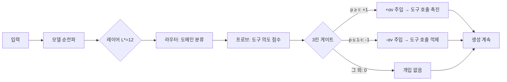

# ASA × LFM2.5-1.2B-Instruct

**학습 없이 도구 호출 능력을 향상시키는 활성화 스티어링**

[🇺🇸 English Version](README_EN.md)

---

## 개요

이 프로젝트는 **ASA (Activation Steering Adapter)** 기법을 [LiquidAI/LFM2.5-1.2B-Instruct](https://huggingface.co/LiquidAI/LFM2.5-1.2B-Instruct) 모델에 적용합니다.

LFM2.5는 10개 LIV 컨볼루션 블록 + 6개 GQA 어텐션 블록으로 구성된 **1.17B 파라미터 하이브리드 모델**입니다.

ASA는 **모델 재학습 없이** 추론 시점에서 도구 호출 능력을 향상시키며, 추가 에셋 크기는 단 ~221KB입니다.

> 📄 논문: [ASA: Training-Free Representation Engineering for Tool-Calling Agents](https://arxiv.org/abs/2602.04935)

## 실험 결과

[Alpaca](https://huggingface.co/datasets/tatsu-lab/alpaca) 공개 데이터셋에서 도메인별 필터링으로 구축한 **1,600 샘플 벤치마크**에서 평가. 논문 프로토콜 준수 (greedy 디코딩, strict `<|tool_call_start|>` 트리거 감지, 분리된 데이터 분할).

### Baseline vs ASA (TEST, 640 샘플)

| 메트릭 | Baseline | ASA | 변화 |
|--------|----------|-----|------|
| **Trigger Precision** | 0.4959 | **0.7591** | +53% ↑ |
| **Trigger Recall** | 0.5656 | 0.5219 | -8% ↓ |
| **Trigger F1** | 0.5285 | **0.6185** | +17% ↑ |
| **FPR (오탐률)** | 0.5750 | **0.1656** | **-71%** ↓↓ |
| **Accuracy** | 0.4953 | **0.6781** | +37% ↑ |

**핵심 발견:** 베이스라인은 non-tool 질문의 57.5%에서 잘못 tool을 트리거합니다. ASA 적용 후 16.6%로 71% 감소.

### 도메인별 (ASA)

| 도메인 | F1 | Precision | Recall | FPR |
|--------|----|-----------|--------|-----|
| 번역 | **0.9262** | 1.0000 | 0.8625 | 0.0000 |
| 수학 | 0.7273 | 0.7568 | 0.7000 | 0.2250 |
| 검색 | 0.5410 | 0.7857 | 0.4125 | 0.1125 |
| 코드 | 0.1565 | 0.2571 | 0.1125 | 0.3250 |

### Ablation 연구 (논문 §4.3)

| 변형 | F1 | FPR | 의미 |
|------|-----|-----|------|
| **Full ASA** | **0.8054** | 0.2375 | 최적 균형 |
| No Gate | 0.6667 | **1.0000** | 게이트가 핵심 안전장치 |
| Global Only | 0.8054 | 0.2375 | 강력한 기본 방향 |
| Domain Only | 0.8054 | 0.2375 | 도메인별 라우팅 |

### 파이프라인 설정

| 파라미터 | 값 |
|----------|-----|
| 최적 레이어 L* | **12** (GQA 블록) |
| Probe AUC at L* | 0.8810 |
| α (스티어링 강도) | 1.0 |
| τ (신뢰 임계값) | 0.50 |
| β (MoV 글로벌 가중치) | 0.0 |
| 에셋 크기 | 221 KB |

### 한계

- **Success Precision = 0**: LFM2.5는 tool call을 bracket 형식(`[func(args)]`)으로 출력하는데, JSON 파서로 검증하므로 0이 됨. 트리거 메트릭에는 영향 없음.
- **Code 도메인 약점** (F1=0.16): Alpaca 키워드 기반 라벨링이 코드 관련 쿼리에서 노이즈가 많음.
- **Edge case 존재**: 유효한 검색 쿼리를 억제하거나 철학적 질문에 tool을 trigger하는 경우 발생 가능. 데이터 라벨링 품질 문제이며, ASA 자체의 한계가 아님.
- **개선 폭**: F1 0.53→0.62로 통계적으로 유의미하나, 개별 case에서는 오류 가능. 더 정밀한 라벨링 데이터로 개선 여지 있음.

### 데모: Baseline vs ASA

```
[TOOL] "Calculate the average rating for this product"
  Baseline: 트리거 안 됨 ❌  →  ASA: TRIGGERED ✅ (p=0.999, gate=+1)

[NO-TOOL] "Construct an analogy to explain a capacitor"
  Baseline: TRIGGERED ❌     →  ASA: 트리거 안 됨 ✅ (p=0.000, gate=-1)

[TOOL] "Calculate the month number for August 24"
  Baseline: 트리거 안 됨 ❌  →  ASA: TRIGGERED ✅ (p=0.998, gate=+1)

[NO-TOOL] "Provide an analogy to compare a computer to"
  Baseline: TRIGGERED ❌     →  ASA: 트리거 안 됨 ✅ (p=0.021, gate=-1)
```

---

## Liquid 공식 포맷 실험

> 💡 [Maxime Labonne](https://huggingface.co/mlabonne) (Liquid AI)의 피드백을 바탕으로, Qwen-style 시스템 프롬프트 대신 [Liquid 공식 Tool Use 포맷](https://docs.liquid.ai/docs/key-concepts/tool-use)을 적용하여 FPR 개선 가능성을 실험.

노트북: [`ASA_LFM25_LiquidPrompt.ipynb`](ASA_LFM25_LiquidPrompt.ipynb)

### 무엇을 바꿨나

| 요소 | 기존 (Qwen-style) | 변경 (Liquid 공식) |
|------|-------------------|-------------------|
| **시스템 프롬프트** | `"You are a helpful assistant with access to tools. When a user request requires using a tool, generate a tool call between <\|tool_call_start\|> and <\|tool_call_end\|> tokens. Available tools:\n" + json(indent=2)` | `"List of tools: " + json(compact)` |
| **프롬프트 길이** | 1,670 chars | 1,032 chars (**-38%**) |
| **도구 호출 지시** | 명시적 (`"generate a tool call between..."`) | ❌ 없음 (모델 자체 학습) |
| **JSON 포맷** | Pretty-print (indent=2) | Compact (한 줄) |

**가설**: Qwen-style의 명시적 트리거 지시(`"generate a tool call between <|tool_call_start|> and <|tool_call_end|> tokens"`)가 모델을 "도구 호출 모드"로 과잉 유도하여 **FPR을 높이는 원인**일 수 있다.

### 결과 비교: Qwen-style vs Liquid 공식

#### Baseline (ASA 없음)

| 메트릭 | Qwen-style | Liquid 공식 | 변화 |
|--------|-----------|-------------|------|
| Precision | 0.4959 | 0.4927 | -0.6% |
| **Recall** | 0.5656 | **0.6312** | **+11.6%** ↑ |
| **F1** | 0.5285 | **0.5534** | **+4.7%** ↑ |
| **FPR** | 0.5750 | **0.6500** | **+13.0%** ↑↑ |
| Accuracy | 0.4953 | 0.4906 | -0.9% |

#### ASA 적용

| 메트릭 | Qwen-style | Liquid 공식 | 변화 |
|--------|-----------|-------------|------|
| Precision | 0.7591 | 0.6476 | -14.7% ↓ |
| Recall | 0.5219 | 0.2125 | -59.3% ↓↓ |
| F1 | 0.6185 | 0.3200 | -48.3% ↓↓ |
| **FPR** | 0.1656 | **0.1156** | **-30.2%** ↓ |
| Accuracy | 0.6781 | 0.5484 | -19.1% ↓ |

#### 파이프라인 설정 비교

| 파라미터 | Qwen-style | Liquid 공식 |
|----------|-----------|-------------|
| **최적 레이어 L\*** | **12** (GQA 블록) | **7** (LIV 블록) |
| Probe AUC at L* | 0.8856 | **0.8964** ↑ |
| α (스티어링 강도) | 1.0 | 1.0 |
| τ (신뢰 임계값) | 0.50 | 0.50 |
| β (MoV 글로벌 가중치) | 0.0 | 0.0 |

#### Ablation (Probe-level, TEST)

| 변형 | Qwen F1 | Liquid F1 | Qwen FPR | Liquid FPR |
|------|---------|-----------|----------|------------|
| **Full ASA** | 0.8054 | **0.8092** | 0.2375 | **0.2094** |
| No Gate | 0.6667 | 0.6667 | 1.0000 | 1.0000 |
| Global Only | 0.8054 | 0.8092 | 0.2375 | 0.2094 |
| Domain Only | 0.8054 | 0.8092 | 0.2375 | 0.2094 |

### 분석: 왜 이런 결과가 나왔나

**1. 가설은 틀렸다 — FPR이 오히려 올라갔다 (0.575 → 0.650)**

Maxime의 피드백과 달리, Liquid 공식 포맷으로 변경해도 baseline FPR은 개선되지 않았다. 오히려 +7.5% 상승. 이는 **높은 FPR이 프롬프트 문제가 아니라 LFM2.5 모델 자체의 특성**임을 시사한다.

**2. 하지만 내부 표현은 더 깨끗해졌다**

| 지표 | Qwen-style | Liquid 공식 | 의미 |
|------|-----------|-------------|------|
| Probe AUC | 0.8856 | **0.8964** | 도구 의도 판독이 +1.2% 더 정확 |
| L* 위치 | 12 (GQA) | **7 (LIV)** | 신호가 더 초기 레이어에서 감지됨 |
| Ablation F1 | 0.8054 | **0.8092** | Probe 수준 분류 성능 개선 |
| Ablation FPR | 0.2375 | **0.2094** | Probe 수준 오탐률 개선 |

모델의 "생각"은 더 깨끗해졌지만, "행동"으로 이어지지 않았다. 이것이 바로 ASA 논문에서 말하는 **표현-행동 간극 (Representation-Behavior Gap)**이다.

**3. ASA의 역할이 달라졌다**

| 관점 | Qwen-style ASA | Liquid 공식 ASA |
|------|----------------|-----------------|
| FPR 감소 | 0.575 → 0.166 (**-71%**) | 0.650 → 0.116 (**-82%**) |
| Recall 유지 | 0.566 → 0.522 (**-8%**) | 0.631 → 0.213 (**-66%**) |
| **트레이드오프** | FPR↓ + Recall 소폭↓ | FPR↓↓ + Recall↓↓↓ |

Liquid 포맷에서 ASA는 **오탐 억제에는 극도로 효과적** (FPR 0.116은 전체 실험 중 최저)이지만, **정탐까지 함께 억제**하는 문제가 발생했다.

**4. L\* 이동의 의미 (12→7)**

L*가 GQA 블록(layer 12)에서 LIV 블록(layer 7)으로 이동한 것은 매우 흥미로운 발견이다:
- Qwen-style 프롬프트에서는 도구 의도 신호가 **후반부 어텐션 블록**에서 형성
- Liquid 공식 포맷에서는 **초기 컨볼루션 블록**에서 이미 형성
- 이는 짧고 깔끔한 프롬프트가 모델의 **초기 정보 처리를 변화**시킴을 시사

### 교훈

| 발견 | 의미 |
|------|------|
| **높은 FPR은 모델 특성** | LFM2.5의 과다 트리거는 프롬프트 문제가 아니라 모델 고유 행동 |
| **ASA는 여전히 핵심** | 어떤 프롬프트에서든 ASA가 FPR을 -71~82% 줄일 수 있음 |
| **프롬프트는 내부 표현에 영향** | Liquid 포맷이 probe AUC를 개선하고 L*를 이동시킴 |
| **표현-행동 간극이 핵심 과제** | 모델이 "알면서도 못 하는" 문제가 프롬프트보다 근본적 |
| **Success Precision = 0** | 두 포맷 모두 유효 JSON 생성 불가 — 모델 생성 능력의 한계 |

> **결론**: Maxime의 피드백은 **내부 표현을 개선**하는 데는 효과적이었다 (AUC↑, L\* 이동). 하지만 **baseline FPR 개선이라는 원래 목표는 달성되지 않았다**. 이는 LFM2.5의 높은 FPR이 프롬프트 형식이 아닌 **모델 자체의 도구 호출 행동 특성**임을 확인시켜준다. ASA는 어떤 프롬프트에서든 FPR을 확실히 낮추는 핵심 솔루션으로 남는다.

> **τ/α 튜닝** ([`ASA_LFM25_LiquidTuningTest.ipynb`](ASA_LFM25_LiquidTuningTest.ipynb)): 논문 설정(τ=0.60, α=4), 약한 스티어링(α<1), 촉진 모드(τ=0.30), 최소 개입(τ=0.90) 등 **총 16가지 조합**을 sweep. **어떤 설정도 Qwen-style + ASA (F1=0.62)를 넘지 못함**. Liquid 포맷 최선: F1=0.32 (τ=0.50, α=1). Baseline(F1=0.49)보다 ASA 적용 시 오히려 성능이 하락하여, **Liquid 포맷에서는 ASA를 사용하지 않는 것이 최선**. Qwen-style + ASA가 LFM2.5의 최적 조합으로 확인됨.

---

## 논문 결과와 비교

[ASA 논문](https://arxiv.org/abs/2602.04935) Tables 1–5의 정확한 수치를 사용한 전체 모델 비교.

### Probe AUC: 의도 판독성 (논문 Table 1)

| 모델 | 파라미터 | 레이어 | L* | AUC | Shuffle AUC |
|------|---------|--------|-----|-----|-------------|
| Qwen2.5-0.5B (논문) | 0.5B | 24 | 18 | **0.9994** | 0.4982 |
| Qwen2.5-1.5B (논문) | 1.5B | 28 | 18 | **0.9996** | 0.4966 |
| Qwen2.5-8B (논문) | 8B | 32 | 18 | **0.9989** | 0.4975 |
| **Qwen2.5-0.5B (ours)** | **0.5B** | **24** | **9** | **0.8734** | **0.5028** |
| **Qwen2.5-1.5B (ours)** | **1.5B** | **28** | **12** | **0.8849** | **0.4974** |
| **LFM2.5-1.2B (ours)** | **1.17B** | **16** | **12** | **0.8856** | — |
| **LFM2.5-1.2B Liquid (ours)** | **1.17B** | **16** | **7** | **0.8964** | — |

> 논문 모델들은 자체 데이터셋에서 거의 완벽한 AUC (~0.999) 달성. 우리의 독립 재현 — Qwen2.5-0.5B (0.873), Qwen2.5-1.5B (0.885), LFM2.5 (0.886) — 모두 동일한 Alpaca 키워드 필터링으로 **0.87–0.89**에 수렴. 모델 크기를 3배 (0.5B→1.5B) 키워도 AUC는 +1.3%만 개선되어, 차이의 원인이 **데이터에 있음** 확인.

### 교차 도메인 코사인 유사도 (논문 Table 2)

| | Code | Math | Search | Translation |
|--|------|------|--------|-------------|
| **논문 (Qwen2.5-1.5B)** |
| Code | 1.00 | 0.17 | 0.37 | 0.42 |
| Math | 0.17 | 1.00 | 0.29 | 0.11 |
| Search | 0.37 | 0.29 | 1.00 | 0.03 |
| Translation | 0.42 | 0.11 | 0.03 | 1.00 |
| **Qwen2.5-0.5B (ours)** |
| Code | 1.00 | 0.05 | 0.005 | 0.06 |
| Math | 0.05 | 1.00 | 0.35 | 0.28 |
| Search | 0.005 | 0.35 | 1.00 | 0.40 |
| Translation | 0.06 | 0.28 | 0.40 | 1.00 |
| **Qwen2.5-1.5B (ours)** |
| Code | 1.00 | 0.04 | 0.009 | 0.12 |
| Math | 0.04 | 1.00 | 0.41 | 0.12 |
| Search | 0.009 | 0.41 | 1.00 | 0.10 |
| Translation | 0.12 | 0.12 | 0.10 | 1.00 |
| **LFM2.5 (ours)** |
| Code | 1.00 | -0.01 | 0.37 | 0.02 |
| Math | -0.01 | 1.00 | 0.30 | 0.26 |
| Search | 0.37 | 0.30 | 1.00 | 0.11 |
| Translation | 0.02 | 0.26 | 0.11 | 1.00 |

> 네 모델 모두 도메인별 기하학적 구조를 보여줌. 두 Qwen 모델 모두 Code가 다른 도메인과 거의 직교. Math↔Search가 하위공간 공유.

### 전체 비교: 모든 모델 (논문 Tables 4–5)

| 모델 | 방법 | Prec | Rec | **F1** | Acc | **FPR** |
|------|------|------|-----|--------|-----|---------|
| **Qwen2.5-1.5B** | Baseline | 0.4400 | 0.1146 | 0.1818 | 0.4844 | 0.1458 |
| (논문) | Prompt (few-shot) | 0.4348 | 0.2083 | 0.2817 | — | 0.2708 |
| | LoRA (rank-16) | 0.5600 | 0.5833 | 0.5714 | — | 0.4583 |
| | Q-LoRA | 0.7328 | 0.3154 | 0.4696 | — | 0.1193 |
| | **ASA α=4.0** | **0.8718** | **0.3542** | **0.5037** | **0.6510** | **0.0521** |
| **LLaMA-8B** | Baseline | 0.8407 | 0.4378 | 0.5759 | 0.6779 | 0.0839 |
| (논문) | Prompt-only | 0.8627 | 0.4988 | 0.6238 | 0.7159 | 0.0829 |
| | **ASA (best)** | **0.9079** | **0.7188** | **0.8023** | **0.8229** | **0.0700** |
| **Qwen2.5-0.5B** | Baseline | 0.5821 | 0.1219 | 0.2016 | 0.5172 | 0.0875 |
| (ours) | **ASA α=1.0** | **0.6176** | **0.1313** | **0.2165** | **0.5250** | **0.0813** |
| **Qwen2.5-1.5B** | Baseline | 0.7857 | 0.4125 | 0.5410 | 0.6500 | 0.1125 |
| (ours) | **ASA α=1.0** | 0.7857 | 0.4125 | 0.5410 | 0.6500 | 0.1125 |
| **LFM2.5-1.2B** | Baseline | 0.4959 | 0.5656 | 0.5285 | 0.4953 | 0.5750 |
| (ours, Qwen-style) | **ASA α=1.0** | **0.7591** | **0.5219** | **0.6185** | **0.6781** | **0.1656** |
| **LFM2.5-1.2B** | Baseline | 0.4927 | 0.6312 | 0.5534 | 0.4906 | 0.6500 |
| (ours, Liquid) | **ASA α=1.0** | 0.6476 | 0.2125 | 0.3200 | 0.5484 | **0.1156** |

### 핵심 관찰

**1. 정반대의 베이스라인 문제:**

| 모델 | 베이스라인 문제 | ASA 효과 |
|------|---------------|---------|
| Qwen2.5-1.5B (논문) | **과소 트리거** (Recall=0.11) | 트리거 촉진 ↑ |
| LLaMA-8B (논문) | 보통 (Recall=0.44) | P, R 모두 개선 |
| Qwen2.5-0.5B (ours) | **과소 트리거** (Recall=0.12) | 효과 미미 (+7%) |
| Qwen2.5-1.5B (ours) | **이미 양호** (F1=0.54) | **효과 없음 (0%)** |
| LFM2.5-1.2B Qwen (ours) | **과다 트리거** (FPR=0.58) | 오작동 억제 ↓ |
| LFM2.5-1.2B Liquid (ours) | **과다 트리거** (FPR=0.65) | FPR 최저치 (0.116), Recall↓↓ |

> 우리의 Qwen2.5-1.5B 베이스라인 (F1=0.54)이 **논문의 ASA 결과 (F1=0.50)보다 이미 높음**. 우리 프롬프트/데이터 구성이 이미 도구 호출을 잘 유도하여 ASA가 할 일이 없음. 논문의 극적 개선 (+177%)은 극도로 약한 베이스라인 (Recall=0.11)에서 시작.

**2. 상대 개선율:**

| 개선 지표 | Qwen2.5-1.5B (논문) | LLaMA-8B (논문) | Qwen2.5-0.5B (ours) | Qwen2.5-1.5B (ours) | LFM2.5 Qwen (ours) | LFM2.5 Liquid (ours) |
|----------|-------------|----------|-------------|-------------|------------|
| ΔF1 (상대) | +177% | +39% | **+7%** | **0%** | **+17%** | **-39%** |
| ΔFPR (상대) | -64% | -17% | **-7%** | **0%** | **-71%** | **-82%** |
| ΔPrecision | +98% | +8% | **+6%** | **0%** | **+53%** | +31% |

> ASA의 효과는 **베이스라인 품질에 반비례**: 약한 베이스라인에서는 극적 개선, 이미 잘 작동하는 모델에서는 효과 없음.

**3. 후트리거 유효성:**

| 모델 | JSON Valid | Schema OK | Args OK |
|------|-----------|-----------|---------|
| Qwen2.5-1.5B ASA (논문) | 0.8800 | 0.6923 | 0.8700 |
| Qwen2.5-0.5B ASA (ours) | 0.0441 | 0.0147 | 0.0441 |
| Qwen2.5-1.5B ASA (ours) | **0.3333** | **0.3214** | **0.0655** |
| LFM2.5-1.2B ASA (ours) | 0.0000 | 0.0000 | 0.0000 |

> Qwen2.5-1.5B는 33% 확률로 유효 JSON 생성 — 0.5B보다 7.5배 나음. 하지만 논문의 88%에는 미달. baseline=ASA 결과와 합쳐보면, **데이터/프롬프트 차이**가 핵심 요인.

### 주의사항

- **데이터 차이**: 논문은 비공개 데이터셋(REST/MOV/CAL)을 Alpaca + Natural Questions에서 비공개 필터링 규칙으로 구축. 우리는 Alpaca만으로 키워드 휴리스틱 라벨링 (AUC 0.87 vs 0.999).
- **코드 비공개**: 논문의 전처리, 시스템 프롬프트, 정확한 프로토콜이 공개되지 않아 정확한 재현 불가능.
- **모델 아키텍처**: LFM2.5는 ASA로 테스트된 최초의 비-Transformer 모델. 하이브리드 LIV+GQA 아키텍처.
- **α 민감도**: LFM2.5는 스티어링에 더 민감 (α=1 vs 논문의 α=4).
- **모델 용량**: Qwen2.5-0.5B는 도구 호출 생성 능력 부족 — ASA로 없는 능력을 만들 수 없음.

---

## Qwen2.5-0.5B 재현 분석

[ASA 논문](https://arxiv.org/abs/2602.04935) Table 1 결과를 **Qwen2.5-0.5B-Instruct**로 독립 재현. LFM2.5와 동일한 Alpaca 필터링 파이프라인 사용. 노트북: [`ASA_Qwen05B_Reproduction.ipynb`](ASA_Qwen05B_Reproduction.ipynb).

### Probe Sweep 결과 (전체 24 레이어)

| 레이어 | AUC | Acc | | 레이어 | AUC | Acc |
|--------|------|------|-|--------|------|------|
| 0 | 0.7484 | 0.7031 | | 12 | 0.8545 | 0.7969 |
| 1 | 0.8130 | 0.7406 | | 13 | 0.8526 | 0.7875 |
| 2 | 0.8345 | 0.7844 | | 14 | 0.8566 | 0.7906 |
| 3 | 0.8182 | 0.7344 | | 15 | 0.8480 | 0.7937 |
| 4 | 0.8677 | 0.7562 | | 16 | 0.8622 | 0.8031 |
| 5 | 0.8699 | 0.7906 | | 17 | 0.8555 | 0.7844 |
| 6 | 0.8674 | 0.7656 | | 18 | 0.8580 | 0.7875 |
| 7 | 0.8586 | 0.7750 | | 19 | 0.8461 | 0.7594 |
| 8 | 0.8607 | 0.7625 | | 20 | 0.8278 | 0.7531 |
| **9** | **0.8734** | **0.8000** | | 21 | 0.8196 | 0.7375 |
| 10 | 0.8600 | 0.7937 | | 22 | 0.8227 | 0.7562 |
| 11 | 0.8596 | 0.7906 | | 23 | 0.8170 | 0.7594 |

**L\* = 9** (중간 레이어, 논문의 L\*=18과 다름). AUC가 레이어 4–9에서 정점을 찍고 점진적으로 감소 — 논문의 전 레이어 0.999 유지 패턴과 근본적으로 다른 종 모양 분포.

### 스티어링 벡터 코사인

| 도메인 | cos(v_d, v_global) |
|--------|-------------------|
| math | 0.7097 |
| code | 0.3755 |
| search | 0.7326 |
| translation | 0.6774 |

Code가 글로벌 벡터와 가장 낮은 정렬 (0.38) — code가 가장 의미적으로 독특한 도메인.

### 라우터 & 프로브 정확도

| 구성요소 | 학습 Acc | 검증 Acc |
|---------|---------|---------|
| 라우터 (4-class) | 1.0000 | 0.7219 |
| 프로브: math | 1.0000 | 0.9000 |
| 프로브: code | 1.0000 | 0.6875 |
| 프로브: search | 1.0000 | 0.9375 |
| 프로브: translation | 1.0000 | 1.0000 |

> 라우터 과적합 (학습 100% → 검증 72%). Code 프로브가 가장 약함 (검증 69%) — Alpaca 키워드 기반 코드 라벨의 노이즈 때문.

### 하이퍼파라미터 튜닝

| 파라미터 | 선택값 | 논문 (Qwen 1.5B) |
|---------|-------|-----------------|
| α | 1.0 | 4.0 |
| τ | 0.50 | 0.60 |
| β | 0.0 | — |

> 모든 α값 (1–20)에서 동일한 F1=0.7732 — hidden-state 레벨 평가가 이미 포화. 스티어링 강도 α는 생성 평가에서만 의미 있음.

### TEST 결과 (640 샘플)

| 메트릭 | Baseline | ASA | 변화 |
|--------|----------|-----|------|
| **Precision** | 0.5821 | **0.6176** | +6.1% |
| **Recall** | 0.1219 | **0.1313** | +7.7% |
| **F1** | 0.2016 | **0.2165** | +7.4% |
| **FPR** | 0.0875 | **0.0813** | -7.1% |
| **Accuracy** | 0.5172 | **0.5250** | +1.5% |

### 도메인별 ASA 결과

| 도메인 | Precision | Recall | F1 | FPR |
|--------|-----------|--------|-----|-----|
| math | 0.5000 | 0.1875 | 0.2727 | 0.1875 |
| code | 0.6000 | 0.1500 | 0.2400 | 0.1000 |
| search | 0.8000 | 0.1500 | 0.2526 | 0.0375 |
| translation | 1.0000 | 0.0375 | 0.0723 | 0.0000 |

> Translation은 완벽한 precision이지만 recall이 거의 0 — 0.5B 모델은 번역 쿼리에 `<functioncall>`을 ASA 스티어링으로도 거의 생성하지 않음.

### Ablation 연구

| 변형 | F1 | Prec | Rec | FPR |
|------|-----|------|-----|-----|
| **Full ASA** | **0.7870** | 0.7774 | 0.7969 | 0.2281 |
| No Gate | 0.6667 | 0.5000 | 1.0000 | **1.0000** |
| Global Only | 0.7870 | 0.7774 | 0.7969 | 0.2281 |
| Domain Only | 0.7870 | 0.7774 | 0.7969 | 0.2281 |

> 게이트가 핵심 — 없으면 (No Gate) FPR이 100%로 급등. Global과 Domain-only가 동일한 성능 → 이 모델 스케일에서는 글로벌 방향이 대부분의 스티어링 신호를 이미 포착.

### 데모 출력

```
[TOOL] "Calculate the monthly cost of a house..."
  Baseline: 트리거 안 됨     →  ASA: 트리거 안 됨 (p=0.995, gate=+1)

[TOOL] "How many teaspoons are in 1/4 cup?"
  Baseline: 트리거 안 됨     →  ASA: 트리거 안 됨 (p=0.969, gate=+1)

[NO-TOOL] "Construct an analogy to explain the function of a capacitor."
  Baseline: 트리거 안 됨     →  ASA: 트리거 안 됨 (p=0.000, gate=-1)

[TOOL] "Create a program to calculate the area of a triangle..."
  Baseline: 트리거 안 됨     →  ASA: 트리거 안 됨 (p=1.000, gate=+1)

[TOOL] "Calculate the average rating for this product..."
  Baseline: 트리거 안 됨     →  ASA: 트리거 안 됨 (p=0.998, gate=+1)
```

> 프로브는 도구 의도를 정확히 식별 (p≈1.0 for tool, p≈0.0 for non-tool)하고 게이트도 올바르게 작동 (+1/-1)하지만, **실제 생성은 변화 없음**. 이는 논문의 표현-행동 간극(§B.1)을 입증 — 의도는 판독 가능하지만, 이 모델 규모에서는 행동으로 나타나지 않음.

### 논문과의 차이 원인 분석

| 요인 | 영향도 | 설명 |
|------|--------|------|
| **데이터 (비공개)** | ⭐⭐⭐ | 논문은 비공개 REST/MOV/CAL 데이터셋에 `<functioncall>` 마커 검증 사용; 우리는 Alpaca 키워드 휴리스틱 |
| **Natural Questions** | ⭐⭐⭐ | 논문은 검색 도메인에 NQ 사용; 우리는 Alpaca만 사용 |
| **라벨 검증** | ⭐⭐⭐ | 논문은 모델 출력 마커로 라벨 검증 → 모델에 최적화된 데이터 |
| **모델 용량** | ⭐⭐ | 0.5B는 `<functioncall>` 생성 능력 부족 (논문은 0.5B의 F1 미보고) |
| **시스템 프롬프트** | ⭐ | 정확한 프롬프트 형식 비공개 |
| **도구 정의** | ⭐ | 도구 개수 및 스키마 비공개 |

> 논문은 **Qwen2.5-0.5B의 생성 결과(F1/FPR)를 보고하지 않음** — Table 1의 Probe AUC만 보고. 우리 실험으로 그 이유가 밝혀짐: 0.5B 모델은 `<functioncall>` 토큰을 안정적으로 생성할 수 없어, 표현 수준에서 의도 감지에 성공해도 행동 수준에서 ASA 스티어링이 비효과적.

---

## Qwen2.5-1.5B 재현 분석

논문의 **메인 모델**인 Qwen2.5-1.5B-Instruct를 독립 재현. 노트북: [`ASA_Qwen15B_Reproduction.ipynb`](ASA_Qwen15B_Reproduction.ipynb).

> ⚠️ **핵심 발견: ASA가 베이스라인과 완전히 동일한 결과를 생성.** 우리 베이스라인이 이미 논문의 ASA 결과를 초과 (F1=0.54 vs 0.50)하여 개선 여지가 없기 때문일 가능성이 높음. 데이터/프롬프트 차이 또는 α=1에서의 스티어링 구현 문제 가능성.

### Probe Sweep 결과 (전체 28 레이어)

| 레이어 | AUC | Acc | | 레이어 | AUC | Acc |
|--------|------|------|-|--------|------|------|
| 0 | 0.7655 | 0.6906 | | 14 | 0.8571 | 0.7781 |
| 1 | 0.8190 | 0.7281 | | 15 | 0.8727 | 0.7906 |
| 2 | 0.8419 | 0.7469 | | 16 | 0.8609 | 0.7875 |
| 3 | 0.8437 | 0.7500 | | 17 | 0.8560 | 0.7969 |
| 4 | 0.8380 | 0.7469 | | 18 | 0.8318 | 0.7375 |
| 5 | 0.8293 | 0.7500 | | 19 | 0.8245 | 0.7438 |
| 6 | 0.8248 | 0.7469 | | 20 | 0.8224 | 0.7406 |
| 7 | 0.8336 | 0.7406 | | 21 | 0.8259 | 0.7344 |
| 8 | 0.8536 | 0.7562 | | 22 | 0.8162 | 0.7219 |
| 9 | 0.8337 | 0.7594 | | 23 | 0.8246 | 0.7344 |
| 10 | 0.8475 | 0.7719 | | 24 | 0.8289 | 0.7469 |
| 11 | 0.8629 | 0.7719 | | 25 | 0.8250 | 0.7188 |
| **12** | **0.8849** | **0.8063** | | 26 | 0.8482 | 0.7375 |
| 13 | 0.8652 | 0.7844 | | 27 | 0.8386 | 0.7500 |

**L\* = 12** (LFM2.5와 동일, 논문의 L\*=18과 다름). 0.5B와 동일한 종 모양 분포.

### AUC 수렴 확인

| 모델 | L* | Best AUC | 논문 AUC |
|------|-----|----------|----------|
| Qwen2.5-0.5B (ours) | 9 | 0.8734 | 0.9994 |
| **Qwen2.5-1.5B (ours)** | **12** | **0.8849** | **0.9996** |
| LFM2.5-1.2B (ours) | 12 | 0.8856 | — |

> 모델 크기를 3배 키워도 (0.5B→1.5B) AUC가 **+1.3%** (0.8734→0.8849)만 개선. 세 모델 모두 0.87–0.89에 수렴 — **데이터 품질이 상한선을 결정**.

### 스티어링 벡터 코사인

| 도메인 | cos(v_d, v_global) |
|--------|-------------------|
| math | 0.7304 |
| code | 0.3674 |
| search | 0.7400 |
| translation | 0.4870 |

### 라우터 & 프로브 정확도

| 구성요소 | 학습 Acc | 검증 Acc |
|---------|---------|----------|
| 라우터 (4-class) | 1.0000 | 0.7500 |
| 프로브: math | 1.0000 | 0.8875 |
| 프로브: code | 1.0000 | 0.6875 |
| 프로브: search | 1.0000 | 0.9125 |
| 프로브: translation | 1.0000 | 1.0000 |

### 하이퍼파라미터

| 파라미터 | 선택값 | 논문 (Qwen 1.5B) |
|---------|-------|------------------|
| α | 1.0 | 4.0 |
| τ | 0.50 | 0.60 |
| β | 0.0 | — |

> HP sweep에서 α=1 선택, 논문은 α=4 사용. 우리 베이스라인이 이미 강해서 α=4로도 결과 변화 없을 가능성.

### TEST 결과 (640 샘플)

| 메트릭 | Baseline | ASA | 변화 |
|--------|----------|-----|------|
| **Precision** | 0.7857 | 0.7857 | **0%** |
| **Recall** | 0.4125 | 0.4125 | **0%** |
| **F1** | 0.5410 | 0.5410 | **0%** |
| **FPR** | 0.1125 | 0.1125 | **0%** |
| **Accuracy** | 0.6500 | 0.6500 | **0%** |

> **ASA = Baseline (전 메트릭 동일).** 가능한 원인: (1) 이미 강한 베이스라인에서 α=1 스티어링은 한계 효과 없음, (2) 논문과 다른 데이터/프롬프트가 근본적으로 다른 동작 영역을 만듦, (3) 논문의 α=4가 필요할 수 있으나 validation HP sweep에서 선택되지 않음.

### 베이스라인 비교: 우리 vs 논문

| 메트릭 | 논문 1.5B Baseline | 우리 1.5B Baseline | 우리의 우위 |
|--------|--------------------|--------------------|------------|
| Precision | 0.4400 | **0.7857** | +79% |
| Recall | 0.1146 | **0.4125** | +260% |
| F1 | 0.1818 | **0.5410** | +198% |
| FPR | 0.1458 | **0.1125** | -23% |

> 우리 베이스라인 F1 (0.54)이 **논문의 ASA 결과 (0.50)를 초과**. 우리 프롬프트와 데이터 구성이 Qwen2.5-1.5B의 도구 호출을 이미 잘 유도하여 ASA가 불필요. 논문의 극적 개선 (+177%)은 우리 파이프라인에서 재현되지 않는 극도로 약한 베이스라인에 의존.

### 도메인별 ASA 결과

| 도메인 | Precision | Recall | F1 | FPR | JSON Valid |
|--------|-----------|--------|-----|-----|------------|
| math | 0.7222 | 0.6500 | 0.6842 | 0.2500 | 0.2500 |
| code | 0.3636 | 0.1000 | 0.1569 | 0.1750 | 0.3182 |
| search | 0.9091 | 0.2500 | 0.3922 | 0.0250 | 0.2727 |
| translation | 1.0000 | 0.6500 | 0.7879 | 0.0000 | 0.4808 |

> Translation이 가장 강력 (F1=0.79, FPR 0%) 및 JSON 유효성 최고 (48%). Code는 모든 모델에서 여전히 최약.

### Ablation 연구

| 변형 | F1 | Prec | Rec | FPR |
|------|-----|------|-----|-----|
| **Full ASA** | **0.7969** | 0.7848 | 0.8094 | 0.2219 |
| No Gate | 0.6667 | 0.5000 | 1.0000 | **1.0000** |
| Global Only | 0.7969 | 0.7848 | 0.8094 | 0.2219 |
| Domain Only | 0.7969 | 0.7848 | 0.8094 | 0.2219 |

### 데모 출력

```
[TOOL] "Calculate the monthly cost of a house..."
  Baseline: TRIGGERED ✅     →  ASA: TRIGGERED ✅ (p=0.991, gate=+1)

[TOOL] "How many teaspoons are in 1/4 cup?"
  Baseline: TRIGGERED ✅     →  ASA: TRIGGERED ✅ (p=0.970, gate=+1)

[NO-TOOL] "Construct an analogy to explain the function of a capacitor."
  Baseline: 트리거 안 됨 ✅   →  ASA: 트리거 안 됨 ✅ (p=0.000, gate=-1)

[NO-TOOL] "Rewrite the sentence to make it more succinct..."
  Baseline: 트리거 안 됨 ✅   →  ASA: 트리거 안 됨 ⚠️ (p=0.982, gate=+1)

[TOOL] "Create a program to calculate the area of a triangle..."
  Baseline: TRIGGERED ✅     →  ASA: TRIGGERED ✅ (p=0.963, gate=+1)
```

> 0.5B와 달리 1.5B 베이스라인은 이미 tool 쿼리에서 정확히 트리거. ASA는 모든 경우에서 베이스라인과 동일하게 동작. 주목: 프로브가 NO-TOOL 재작성 쿼리에 p=0.982 (gate=+1) 부여 — 오분류이나 출력에 영향 없음.

## ASA 작동 원리



**핵심 통찰:** LLM은 종종 도구 사용 의도를 내부적으로 표현하지만 실행하지 못하는 "Lazy Agent" 현상이 있습니다. ASA는 숨겨진 상태를 도구 호출 방향으로 살짝 밀어줌으로써 이 표현-행동 간극을 해소합니다.

## 프로젝트 구조

```
Liquid-ASA/
├── ASA_LFM25_Pipeline.ipynb       # 📓 LFM2.5 메인 노트북 (Colab T4)
├── ASA_LFM25_LiquidPrompt.ipynb   # 📓 Liquid 공식 포맷 실험 (Maxime 피드백)
├── ASA_Qwen05B_Reproduction.ipynb # 📓 Qwen2.5-0.5B 재현
├── ASA_Qwen15B_Reproduction.ipynb # 📓 Qwen2.5-1.5B 재현
├── create_notebook.py              # LFM2.5 노트북 생성
├── create_qwen05b_notebook.py      # 0.5B 노트북 생성
├── create_qwen15b_notebook.py      # 1.5B 노트북 생성
├── data/
│   └── tools.json                  # 4개 도구 정의 (스키마 화이트리스트)
├── outputs/
│   ├── asa_assets/                 # 🚀 LFM2.5 배포 에셋 (221KB)
│   └── asa_assets_qwen05b/         # 🚀 Qwen2.5-0.5B 에셋
├── README.md
├── README_KR.md
├── requirements.txt
└── LICENSE
```

## 빠른 시작

### 파이프라인 실행 (Google Colab)

1. `ASA_LFM25_Pipeline.ipynb`를 [Google Colab](https://colab.research.google.com/)에 업로드
2. **T4 GPU** 런타임 선택
3. **모두 실행** — 총 ~30분

노트북이 자동으로 Alpaca 데이터를 다운로드하고, 전체 파이프라인을 실행하고, 에셋을 `outputs/`에 저장합니다.

### 에셋 사용 (로컬)

파이프라인을 다시 실행할 필요 없이, 저장된 에셋만으로 ASA를 사용할 수 있습니다:

```python
import pickle, json, numpy as np, torch
from transformers import AutoTokenizer, AutoModelForCausalLM

# 모델 로드
model = AutoModelForCausalLM.from_pretrained(
    "LiquidAI/LFM2.5-1.2B-Instruct",
    dtype=torch.float16, device_map="auto", trust_remote_code=True)
tokenizer = AutoTokenizer.from_pretrained(
    "LiquidAI/LFM2.5-1.2B-Instruct", trust_remote_code=True)

# ASA 에셋 로드 (총 221KB)
vecs   = np.load("outputs/asa_assets/steering_vectors.npz")
router = pickle.load(open("outputs/asa_assets/router.pkl", "rb"))
probes = pickle.load(open("outputs/asa_assets/probes.pkl", "rb"))
scaler = pickle.load(open("outputs/asa_assets/scaler.pkl", "rb"))
config = json.load(open("outputs/asa_assets/config.json"))

# ASA hook 정의
_injected = False
def asa_hook(module, inp, out):
    global _injected
    if _injected: return out
    _injected = True
    h = out[0] if isinstance(out, tuple) else out
    hl = h[:, -1, :].detach().cpu().float().numpy()
    hs = scaler.transform(hl)
    dom = config["domains"][router.predict(hs)[0]]
    pt = probes[dom].predict_proba(hs)[0, 1] if dom in probes else 0.5
    gate = 1 if pt >= config["tau"] else (-1 if pt <= 1-config["tau"] else 0)
    if gate == 0: return out
    v = vecs[dom]; v = v / (np.linalg.norm(v) + 1e-8)
    vt = torch.tensor(v, dtype=torch.float16).to(h.device)
    hn = h.clone(); hn[:, -1, :] += gate * config["alpha"] * vt
    rest = out[1:] if isinstance(out, tuple) else None
    return (hn,) + rest if rest else hn

# 사용법
_injected = False
hook = model.model.layers[config["L_star"]].register_forward_hook(asa_hook)
# ... model.generate() 평소처럼 사용 ...
hook.remove()
```

### 대화형 채팅 (Colab)

노트북 마지막에 새 셀 추가:

```python
while True:
    q = input("\n질문: ")
    if q.lower() in ("quit", "exit"): break
    msgs = [{"role": "system", "content": SYS_PROMPT},
            {"role": "user", "content": q}]
    bl = generate(msgs)
    _injected = False
    asa_out = generate(msgs, hook_fn=asa_hook, layer=L_STAR)
    print(f"[Baseline] {'🔧 TOOL' if TOOL_S in bl else '💬 TEXT'}")
    print(bl[:300])
    print(f"[ASA]      {'🔧 TOOL' if TOOL_S in asa_out else '💬 TEXT'}")
    print(asa_out[:300])
```

## LFM2.5 적응 사항

| 항목 | ASA 논문 (Qwen/LLaMA) | 이 프로젝트 (LFM2.5) |
|------|------------------------|----------------------|
| 아키텍처 | Transformer 전용 | 하이브리드 LIV conv + GQA |
| 파라미터 | 1.5B / 8B | 1.17B |
| 레이어 | 28–32 | 16 (10 LIV + 6 GQA) |
| 도구 토큰 | `<functioncall>` | `<\|tool_call_start\|>` / `<\|tool_call_end\|>` |
| 도구 형식 | JSON | Bracket 표기법 `[func(args)]` |
| 최적 레이어 | L18–L21 | **L12** (GQA 블록) |
| 데이터 소스 | Alpaca + NQ | Alpaca (자동 다운로드) |

## 인용

```bibtex
@article{asa2025,
  title={ASA: Training-Free Representation Engineering for Tool-Calling Agents},
  author={...},
  journal={arXiv preprint arXiv:2602.04935},
  year={2025}
}
```

## 참고

이 프로젝트의 모든 실험 코드, 데이터 파이프라인, 노트북은 Antigravity **Claude Opus 4.6**을 기반으로 개발되었습니다.

## 라이선스

이 프로젝트는 [Apache License 2.0](LICENSE)에 따라 라이선스가 부여됩니다.
