# ASA × LFM2.5-1.2B-Instruct

**Training-Free Tool-Calling Enhancement via Activation Steering**

[🇰🇷 한국어 버전](README_KR.md)

---

## Overview

This project applies the **ASA (Activation Steering Adapter)** technique to [LiquidAI/LFM2.5-1.2B-Instruct](https://huggingface.co/LiquidAI/LFM2.5-1.2B-Instruct) — a 1.17B parameter hybrid model with 10 LIV convolution blocks + 6 GQA attention blocks.

ASA enhances tool-calling capabilities at inference time **without any model retraining**, using only ~221KB of additional assets.

> 📄 Paper: [ASA: Training-Free Representation Engineering for Tool-Calling Agents](https://arxiv.org/abs/2602.04935)

## Results

Evaluated on a **1,600-sample benchmark** built from the [Alpaca](https://huggingface.co/datasets/tatsu-lab/alpaca) public dataset with domain-specific filtering. The protocol follows the paper: greedy decoding, strict `<|tool_call_start|>` trigger detection, disjoint data splits (CAL / TRAIN / VALID / TEST).

### Baseline vs ASA (TEST set, 640 samples)

| Metric | Baseline | ASA | Change |
|--------|----------|-----|--------|
| **Trigger Precision** | 0.4959 | **0.7591** | +53% ↑ |
| **Trigger Recall** | 0.5656 | 0.5219 | -8% ↓ |
| **Trigger F1** | 0.5285 | **0.6185** | +17% ↑ |
| **FPR** | 0.5750 | **0.1656** | **-71%** ↓↓ |
| **Accuracy** | 0.4953 | **0.6781** | +37% ↑ |

**Key finding:** The baseline model falsely triggers tool calls on 57.5% of non-tool queries. ASA reduces this to 16.6% — a 71% reduction in false positives, while improving overall F1 by 17%.

### Per-Domain (ASA)

| Domain | F1 | Precision | Recall | FPR |
|--------|----|-----------|--------|-----|
| Translation | **0.9262** | 1.0000 | 0.8625 | 0.0000 |
| Math | 0.7273 | 0.7568 | 0.7000 | 0.2250 |
| Search | 0.5410 | 0.7857 | 0.4125 | 0.1125 |
| Code | 0.1565 | 0.2571 | 0.1125 | 0.3250 |

### Ablation (Paper §4.3)

| Variant | F1 | FPR | Takeaway |
|---------|-----|-----|----------|
| **Full ASA** | **0.8054** | 0.2375 | Best balance |
| No Gate | 0.6667 | **1.0000** | Gate is the critical safety valve |
| Global Only | 0.8054 | 0.2375 | Strong baseline direction |
| Domain Only | 0.8054 | 0.2375 | Domain-specific routing |

### Pipeline Config

| Parameter | Value |
|-----------|-------|
| Optimal Layer L* | **12** (GQA block) |
| Probe AUC at L* | 0.8810 |
| α (steering strength) | 1.0 |
| τ (confidence threshold) | 0.50 |
| β (MoV global weight) | 0.0 |
| Asset size | 221 KB |

### Limitations

- **Success Precision = 0**: LFM2.5 outputs tool calls in bracket notation (`[func(args)]`), not JSON. The JSON parser doesn't match this format. Trigger-level metrics are unaffected.
- **Code domain weak** (F1=0.16): Keyword-based heuristic labeling from Alpaca is noisy for code-related queries.
- **Edge cases exist**: ASA may suppress valid search queries or trigger on philosophical questions. This is a data labeling quality issue, not a fundamental ASA limitation.
- **Improvement headroom**: F1 improved 0.53→0.62, meaningful but not dramatic. Better labeled data would likely yield larger gains.

### Demo: Baseline vs ASA

```
[TOOL] "Calculate the average rating for this product"
  Baseline: no trigger ❌     →  ASA: TRIGGERED ✅ (p=0.999, gate=+1)

[NO-TOOL] "Construct an analogy to explain a capacitor"
  Baseline: TRIGGERED ❌      →  ASA: no trigger ✅ (p=0.000, gate=-1)

[TOOL] "Calculate the month number for August 24"
  Baseline: no trigger ❌     →  ASA: TRIGGERED ✅ (p=0.998, gate=+1)

[NO-TOOL] "Provide an analogy to compare a computer to"
  Baseline: TRIGGERED ❌      →  ASA: no trigger ✅ (p=0.021, gate=-1)
```

## How ASA Works

```mermaid
graph LR
    A[Input] --> B[Model Forward Pass]
    B --> C{Layer L*=12}
    C --> D[Router: Classify Domain]
    D --> E[Probe: Tool Intent Score]
    E --> F{Ternary Gate}
    F -->|p ≥ τ: +1| G[Inject +αv → Promote Tool Call]
    F -->|p ≤ 1-τ: -1| H[Inject -αv → Suppress Tool Call]
    F -->|else: 0| I[No Intervention]
    G --> J[Continue Generation]
    H --> J
    I --> J
```



**Key insight:** LLMs often *internally represent* tool-use intent but fail to act on it ("Lazy Agent" phenomenon). ASA bridges this representation-behavior gap by nudging the hidden state toward the tool-calling direction at a single layer, with no weight modification.

## Project Structure

```
Liquid-ASA/
├── ASA_LFM25_Pipeline.ipynb    # 📓 Main notebook (Colab T4)
├── create_notebook.py           # Generates the .ipynb
├── data/
│   └── tools.json               # 4 tool definitions (schema whitelist)
├── outputs/
│   ├── asa_assets/              # 🚀 Deployable assets (221KB)
│   │   ├── config.json          #    L*=12, α=1, τ=0.5, β=0.0
│   │   ├── steering_vectors.npz #    Domain + global vectors
│   │   ├── router.pkl           #    Domain classifier
│   │   ├── probes.pkl           #    Per-domain intent probes
│   │   └── scaler.pkl           #    Hidden state normalizer
│   ├── probe_sweep.png          # Layer AUC visualization
│   ├── hp_sweep.png             # α/τ/β tuning plots
│   └── baseline_vs_asa.png      # Comparison chart
├── README.md
├── README_KR.md
├── requirements.txt
└── LICENSE
```

## Quick Start

### Run the Pipeline (Google Colab)

1. Upload `ASA_LFM25_Pipeline.ipynb` to [Google Colab](https://colab.research.google.com/)
2. Select **T4 GPU** runtime
3. **Run All** — ~30 minutes total

The notebook automatically downloads Alpaca data, runs the full pipeline, and saves assets to `outputs/`.

### Use Pre-built Assets (Local)

If you just want to **use** the ASA assets without re-running the pipeline:

```python
import pickle, json, numpy as np, torch
from transformers import AutoTokenizer, AutoModelForCausalLM

# Load model
model = AutoModelForCausalLM.from_pretrained(
    "LiquidAI/LFM2.5-1.2B-Instruct",
    dtype=torch.float16, device_map="auto", trust_remote_code=True)
tokenizer = AutoTokenizer.from_pretrained(
    "LiquidAI/LFM2.5-1.2B-Instruct", trust_remote_code=True)

# Load ASA assets (221KB total)
vecs   = np.load("outputs/asa_assets/steering_vectors.npz")
router = pickle.load(open("outputs/asa_assets/router.pkl", "rb"))
probes = pickle.load(open("outputs/asa_assets/probes.pkl", "rb"))
scaler = pickle.load(open("outputs/asa_assets/scaler.pkl", "rb"))
config = json.load(open("outputs/asa_assets/config.json"))

# Define ASA hook
_injected = False
def asa_hook(module, inp, out):
    global _injected
    if _injected: return out
    _injected = True
    h = out[0] if isinstance(out, tuple) else out
    hl = h[:, -1, :].detach().cpu().float().numpy()
    hs = scaler.transform(hl)
    dom = config["domains"][router.predict(hs)[0]]
    pt = probes[dom].predict_proba(hs)[0, 1] if dom in probes else 0.5
    gate = 1 if pt >= config["tau"] else (-1 if pt <= 1-config["tau"] else 0)
    if gate == 0: return out
    v = vecs[dom]; v = v / (np.linalg.norm(v) + 1e-8)
    vt = torch.tensor(v, dtype=torch.float16).to(h.device)
    hn = h.clone(); hn[:, -1, :] += gate * config["alpha"] * vt
    rest = out[1:] if isinstance(out, tuple) else None
    return (hn,) + rest if rest else hn

# Use it
_injected = False
hook = model.model.layers[config["L_star"]].register_forward_hook(asa_hook)
# ... model.generate() as normal ...
hook.remove()
```

### Interactive Chat (Colab)

Add a new cell at the end of the notebook:

```python
while True:
    q = input("\nQuery: ")
    if q.lower() in ("quit", "exit"): break
    msgs = [{"role": "system", "content": SYS_PROMPT},
            {"role": "user", "content": q}]
    bl = generate(msgs)
    _injected = False
    asa_out = generate(msgs, hook_fn=asa_hook, layer=L_STAR)
    print(f"[Baseline] {'🔧 TOOL' if TOOL_S in bl else '💬 TEXT'}")
    print(bl[:300])
    print(f"[ASA]      {'🔧 TOOL' if TOOL_S in asa_out else '💬 TEXT'}")
    print(asa_out[:300])
```

## LFM2.5 Adaptations

| Aspect | ASA Paper (Qwen/LLaMA) | This Project (LFM2.5) |
|--------|------------------------|----------------------|
| Architecture | Transformer-only | Hybrid LIV conv + GQA |
| Parameters | 1.5B / 8B | 1.17B |
| Layers | 28–32 | 16 (10 LIV + 6 GQA) |
| Tool tokens | `<functioncall>` | `<\|tool_call_start\|>` / `<\|tool_call_end\|>` |
| Tool format | JSON | Bracket notation `[func(args)]` |
| Optimal Layer | L18–L21 | **L12** (GQA block) |
| Data source | Alpaca + NQ | Alpaca (auto-downloaded) |

## Citation

```bibtex
@article{asa2025,
  title={ASA: Training-Free Representation Engineering for Tool-Calling Agents},
  author={...},
  journal={arXiv preprint arXiv:2602.04935},
  year={2025}
}
```

## License

This project is licensed under the [Apache License 2.0](LICENSE).
