# ASA × LFM2.5-1.2B-Instruct

**Training-Free Tool-Calling Enhancement via Activation Steering**

[🇰🇷 한국어 버전](README_KR.md)

---

## Overview

This project applies the **ASA (Activation Steering Adapter)** technique to [LiquidAI/LFM2.5-1.2B-Instruct](https://huggingface.co/LiquidAI/LFM2.5-1.2B-Instruct) — a 1.17B parameter hybrid model with 10 LIV convolution blocks + 6 GQA attention blocks.

ASA enhances tool-calling capabilities at inference time **without any model retraining**, using only ~20KB of additional assets.

> 📄 Paper: [ASA: Training-Free Representation Engineering for Tool-Calling Agents](https://arxiv.org/abs/2602.04935)

## How ASA Works

```mermaid
graph LR
    A[Input] --> B[Model Forward Pass]
    B --> C{Layer L*}
    C --> D[Router: Classify Domain]
    D --> E[Probe: Tool Intent Score]
    E --> F{Ternary Gate}
    F -->|p ≥ τ: +1| G[Inject +αv → Promote Tool Call]
    F -->|p ≤ 1-τ: -1| H[Inject -αv → Suppress Tool Call]
    F -->|else: 0| I[No Intervention]
    G --> J[Continue Generation]
    H --> J
    I --> J
```



**Key insight:** LLMs often *internally represent* tool-use intent but fail to act on it ("Lazy Agent" phenomenon). ASA bridges this representation-behavior gap by nudging the hidden state toward the tool-calling direction.

## Project Structure

```
Liquid-ASA/
├── data/
│   ├── tools.json           # 4 tool definitions
│   ├── cal_data.json         # 320 calibration samples (vector extraction)
│   ├── train_data.json       # 320 training samples (router/probe)
│   ├── valid_data.json       # 160 validation samples (hyperparameter tuning)
│   └── test_data.json        # 320 test samples (evaluation)
├── notebooks/
│   └── asa_lfm25_colab.py    # Complete pipeline (Colab T4 compatible)
├── outputs/                  # Generated assets, plots, checkpoints
├── ASA_LFM2.5_Implementation_Plan.md
├── README.md                 # English
├── README_KR.md              # 한국어
├── requirements.txt
└── .gitignore
```

## Quick Start

### Option 1: Google Colab (Recommended)

1. Open [Google Colab](https://colab.research.google.com/)
2. Clone and run:

```python
!git clone https://github.com/gyunggyung/Liquid-ASA.git
%cd Liquid-ASA
```

3. Convert to notebook for **cell-by-cell execution**:

```python
!pip install -q jupytext
!jupytext --to ipynb notebooks/asa_lfm25_colab.py -o notebooks/asa_lfm25_colab.ipynb
```

4. Open `notebooks/asa_lfm25_colab.ipynb` and run each cell step by step.

### Option 2: Local Execution

```bash
git clone https://github.com/gyunggyung/Liquid-ASA.git
cd Liquid-ASA
pip install -r requirements.txt
python notebooks/asa_lfm25_colab.py
```

### Option 3: VS Code (Jupyter Extension)

Open `notebooks/asa_lfm25_colab.py` in VS Code with the Jupyter extension — all `# %%` cells are recognized automatically. Run each cell with **Shift+Enter**.

## Pipeline Stages

| Stage | Description | Output |
|-------|-------------|--------|
| 1. Setup | Install deps, detect GPU | — |
| 2. Data Loading | Load 1,120 samples, verify splits | Data stats |
| 3. Model Loading | Load LFM2.5 in float16 | Model info |
| 4. Hidden State Extraction | Forward hooks at all 16 layers | `{layer: (N, D)}` arrays |
| 5. Probe Sweep | Logistic regression AUC per layer | Best layer L* + plot |
| 6. Steering Vectors | Mean-diff vectors from CAL data | Per-domain + global vectors |
| 7. Router & Probes | Multi-class router + binary probes | Trained classifiers |
| 8. ASA Controller | `ASAController` with MoV + gate | Controller object |
| 9. Hyperparameter Tuning | Grid sweep α, τ, β on VALID | Optimal hyperparameters + plot |
| 10. Evaluation | Trigger metrics on TEST set | Precision/Recall/F1/FPR |
| 11. HF Upload | Save ~20KB assets to HuggingFace | Model card + assets |
| 12. Demo | Side-by-side baseline vs ASA | Interactive comparison |

> 💡 Each stage is **checkpointed** — you can resume from any point. Intermediate results are saved to `outputs/`.

## Dataset

**1,120 manually crafted samples** across 4 domains × 4 splits:

| Domain | Tools | Example (Tool) | Example (Non-Tool) |
|--------|-------|-----------------|---------------------|
| Math | `calculator` | "Calculate 15% tip on $85" | "Tell me about Euler" |
| Code | `python_interpreter` | "Sort the list [5,2,8,1]" | "What is recursion?" |
| Search | `web_search` | "Find latest AI news" | "What is photosynthesis?" |
| Translation | `translator` | "Translate 'hello' to Korean" | "History of English language" |

## LFM2.5 Adaptations

| Aspect | ASA Paper (Qwen/LLaMA) | This Project (LFM2.5) |
|--------|------------------------|----------------------|
| Architecture | Transformer-only | Hybrid LIV conv + GQA |
| Parameters | 1.5B / 8B | 1.17B |
| Layers | 28–32 | 16 (10 LIV + 6 GQA) |
| Tool tokens | `<functioncall>` | `<\|tool_call_start\|>` / `<\|tool_call_end\|>` |
| Tool format | JSON | Pythonic (Python list syntax) |
| Intervention | Single optimal layer | Probe sweep across all 16 |

## Expected Results

Based on the ASA paper's findings on similar-sized models (Qwen2.5-1.5B):

| Metric | Baseline | ASA (expected) |
|--------|----------|----------------|
| F1 Score | ~0.65 | ~0.80+ |
| FPR | ~0.15 | ~0.05 |
| Asset Size | — | ~20KB |
| Latency Overhead | — | <1ms |

## Citation

```bibtex
@article{asa2025,
  title={ASA: Training-Free Representation Engineering for Tool-Calling Agents},
  author={...},
  journal={arXiv preprint arXiv:2602.04935},
  year={2025}
}
```

## License

This project is licensed under the [Apache License 2.0](LICENSE).
