# ASA × LFM2.5-1.2B-Instruct

**Training-Free Tool-Calling Enhancement via Activation Steering**

[🇰🇷 한국어 버전](README.md)

---

## Overview

This project applies the **ASA (Activation Steering Adapter)** technique to [LiquidAI/LFM2.5-1.2B-Instruct](https://huggingface.co/LiquidAI/LFM2.5-1.2B-Instruct) — a 1.17B parameter hybrid model with 10 LIV convolution blocks + 6 GQA attention blocks.

ASA enhances tool-calling capabilities at inference time **without any model retraining**, using only ~221KB of additional assets.

> 📄 Paper: [ASA: Training-Free Representation Engineering for Tool-Calling Agents](https://arxiv.org/abs/2602.04935)

## Results

Evaluated on a **1,600-sample benchmark** built from the [Alpaca](https://huggingface.co/datasets/tatsu-lab/alpaca) public dataset with domain-specific filtering. The protocol follows the paper: greedy decoding, strict `<|tool_call_start|>` trigger detection, disjoint data splits (CAL / TRAIN / VALID / TEST).

### Baseline vs ASA (TEST set, 640 samples)

| Metric | Baseline | ASA | Change |
|--------|----------|-----|--------|
| **Trigger Precision** | 0.4959 | **0.7591** | +53% ↑ |
| **Trigger Recall** | 0.5656 | 0.5219 | -8% ↓ |
| **Trigger F1** | 0.5285 | **0.6185** | +17% ↑ |
| **FPR** | 0.5750 | **0.1656** | **-71%** ↓↓ |
| **Accuracy** | 0.4953 | **0.6781** | +37% ↑ |

**Key finding:** The baseline model falsely triggers tool calls on 57.5% of non-tool queries. ASA reduces this to 16.6% — a 71% reduction in false positives, while improving overall F1 by 17%.

### Per-Domain (ASA)

| Domain | F1 | Precision | Recall | FPR |
|--------|----|-----------|--------|-----|
| Translation | **0.9262** | 1.0000 | 0.8625 | 0.0000 |
| Math | 0.7273 | 0.7568 | 0.7000 | 0.2250 |
| Search | 0.5410 | 0.7857 | 0.4125 | 0.1125 |
| Code | 0.1565 | 0.2571 | 0.1125 | 0.3250 |

### Ablation (Paper §4.3)

| Variant | F1 | FPR | Takeaway |
|---------|-----|-----|----------|
| **Full ASA** | **0.8054** | 0.2375 | Best balance |
| No Gate | 0.6667 | **1.0000** | Gate is the critical safety valve |
| Global Only | 0.8054 | 0.2375 | Strong baseline direction |
| Domain Only | 0.8054 | 0.2375 | Domain-specific routing |

### Pipeline Config

| Parameter | Value |
|-----------|-------|
| Optimal Layer L* | **12** (GQA block) |
| Probe AUC at L* | 0.8810 |
| α (steering strength) | 1.0 |
| τ (confidence threshold) | 0.50 |
| β (MoV global weight) | 0.0 |
| Asset size | 221 KB |

### Limitations

- **Success Precision = 0**: LFM2.5 outputs tool calls in bracket notation (`[func(args)]`), not JSON. The JSON parser doesn't match this format. Trigger-level metrics are unaffected.
- **Code domain weak** (F1=0.16): Keyword-based heuristic labeling from Alpaca is noisy for code-related queries.
- **Edge cases exist**: ASA may suppress valid search queries or trigger on philosophical questions. This is a data labeling quality issue, not a fundamental ASA limitation.
- **Improvement headroom**: F1 improved 0.53→0.62, meaningful but not dramatic. Better labeled data would likely yield larger gains.

### Demo: Baseline vs ASA

```
[TOOL] "Calculate the average rating for this product"
  Baseline: no trigger ❌     →  ASA: TRIGGERED ✅ (p=0.999, gate=+1)

[NO-TOOL] "Construct an analogy to explain a capacitor"
  Baseline: TRIGGERED ❌      →  ASA: no trigger ✅ (p=0.000, gate=-1)

[TOOL] "Calculate the month number for August 24"
  Baseline: no trigger ❌     →  ASA: TRIGGERED ✅ (p=0.998, gate=+1)

[NO-TOOL] "Provide an analogy to compare a computer to"
  Baseline: TRIGGERED ❌      →  ASA: no trigger ✅ (p=0.021, gate=-1)
```

## Comparison with Paper Results

Full cross-model comparison using exact numbers from the [ASA paper](https://arxiv.org/abs/2602.04935) (Tables 1–5).

### Probe AUC: Intent Readability (Paper Table 1)

| Model | Params | Layers | L* | AUC | Shuffle AUC |
|-------|--------|--------|-----|-----|-------------|
| Qwen2.5-0.5B (paper) | 0.5B | 24 | 18 | **0.9994** | 0.4982 |
| Qwen2.5-1.5B (paper) | 1.5B | 28 | 18 | **0.9996** | 0.4966 |
| Qwen2.5-8B (paper) | 8B | 32 | 18 | **0.9989** | 0.4975 |
| **Qwen2.5-0.5B (ours)** | **0.5B** | **24** | **9** | **0.8734** | **0.5028** |
| **Qwen2.5-1.5B (ours)** | **1.5B** | **28** | **12** | **0.8849** | **0.4974** |
| **LFM2.5-1.2B (ours)** | **1.17B** | **16** | **12** | **0.8856** | — |

> Paper models achieve near-perfect AUC (~0.999) on their proprietary dataset. Our independent reproductions — Qwen2.5-0.5B (0.873), Qwen2.5-1.5B (0.885), and LFM2.5 (0.886) — all converge to **0.87–0.89** using the same Alpaca keyword-filtering pipeline. Even tripling model size (0.5B→1.5B) only improves AUC by +1.3%, confirming the gap is **data-driven, not model-driven**.

### Cross-Domain Cosine Similarity (Paper Table 2)

| | Code | Math | Search | Translation |
|--|------|------|--------|-------------|
| **Paper (Qwen2.5-1.5B)** |
| Code | 1.00 | 0.17 | 0.37 | 0.42 |
| Math | 0.17 | 1.00 | 0.29 | 0.11 |
| Search | 0.37 | 0.29 | 1.00 | 0.03 |
| Translation | 0.42 | 0.11 | 0.03 | 1.00 |
| **Qwen2.5-0.5B (ours)** |
| Code | 1.00 | 0.05 | 0.005 | 0.06 |
| Math | 0.05 | 1.00 | 0.35 | 0.28 |
| Search | 0.005 | 0.35 | 1.00 | 0.40 |
| Translation | 0.06 | 0.28 | 0.40 | 1.00 |
| **Qwen2.5-1.5B (ours)** |
| Code | 1.00 | 0.04 | 0.009 | 0.12 |
| Math | 0.04 | 1.00 | 0.41 | 0.12 |
| Search | 0.009 | 0.41 | 1.00 | 0.10 |
| Translation | 0.12 | 0.12 | 0.10 | 1.00 |
| **LFM2.5 (ours)** |
| Code | 1.00 | -0.01 | 0.37 | 0.02 |
| Math | -0.01 | 1.00 | 0.30 | 0.26 |
| Search | 0.37 | 0.30 | 1.00 | 0.11 |
| Translation | 0.02 | 0.26 | 0.11 | 1.00 |

> All four models show domain-specific geometry — directions are not random. Both Qwen models show Code nearly orthogonal to others, and Math↔Search sharing subspace. Qwen2.5-1.5B has more compact cross-domain cosines (max off-diagonal 0.41) vs 0.5B (max 0.40).

### Main Results: All Models (Paper Tables 4–5)

| Model | Method | Prec | Rec | **F1** | Acc | **FPR** |
|-------|--------|------|-----|--------|-----|---------|
| **Qwen2.5-1.5B** | Baseline | 0.4400 | 0.1146 | 0.1818 | 0.4844 | 0.1458 |
| (paper) | Prompt (few-shot) | 0.4348 | 0.2083 | 0.2817 | — | 0.2708 |
| | LoRA (rank-16) | 0.5600 | 0.5833 | 0.5714 | — | 0.4583 |
| | Q-LoRA | 0.7328 | 0.3154 | 0.4696 | — | 0.1193 |
| | **ASA α=4.0** | **0.8718** | **0.3542** | **0.5037** | **0.6510** | **0.0521** |
| **LLaMA-8B** | Baseline | 0.8407 | 0.4378 | 0.5759 | 0.6779 | 0.0839 |
| (paper) | Prompt-only | 0.8627 | 0.4988 | 0.6238 | 0.7159 | 0.0829 |
| | **ASA (best)** | **0.9079** | **0.7188** | **0.8023** | **0.8229** | **0.0700** |
| **Qwen2.5-0.5B** | Baseline | 0.5821 | 0.1219 | 0.2016 | 0.5172 | 0.0875 |
| (ours) | **ASA α=1.0** | **0.6176** | **0.1313** | **0.2165** | **0.5250** | **0.0813** |
| **Qwen2.5-1.5B** | Baseline | 0.7857 | 0.4125 | 0.5410 | 0.6500 | 0.1125 |
| (ours) | **ASA α=1.0** | 0.7857 | 0.4125 | 0.5410 | 0.6500 | 0.1125 |
| **LFM2.5-1.2B** | Baseline | 0.4959 | 0.5656 | 0.5285 | 0.4953 | 0.5750 |
| (ours) | **ASA α=1.0** | **0.7591** | **0.5219** | **0.6185** | **0.6781** | **0.1656** |

### Key Observations

**1. Opposite baseline problems:**

| Model | Baseline Problem | ASA Effect |
|-------|-----------------|------------|
| Qwen2.5-1.5B (paper) | **Under-triggers** (Recall=0.11) | Promotes triggers ↑ |
| LLaMA-8B (paper) | Moderate (Recall=0.44) | Improves both P and R |
| Qwen2.5-0.5B (ours) | **Under-triggers** (Recall=0.12) | Minimal effect (+7%) |
| Qwen2.5-1.5B (ours) | **Already good** (F1=0.54) | **No effect (0%)** |
| LFM2.5-1.2B (ours) | **Over-triggers** (FPR=0.58) | Suppresses false triggers ↓ |

> Our Qwen2.5-1.5B baseline (F1=0.54) **already outperforms the paper's ASA result** (F1=0.50). This means our prompt/data setup already elicits good tool-calling, leaving no room for ASA improvement. The paper's dramatic +177% gain comes from an extremely weak baseline (Recall=0.11) that we cannot reproduce.

**2. Relative improvements:**

| Improvement | Qwen2.5-1.5B (paper) | LLaMA-8B (paper) | Qwen2.5-0.5B (ours) | Qwen2.5-1.5B (ours) | LFM2.5-1.2B (ours) |
|-------------|-------------|----------|-------------|-------------|------------|
| ΔF1 (relative) | +177% | +39% | **+7%** | **0%** | **+17%** |
| ΔFPR (relative) | -64% | -17% | **-7%** | **0%** | **-71%** |
| ΔPrecision | +98% | +8% | **+6%** | **0%** | **+53%** |

> ASA's effectiveness is **inversely proportional to baseline quality**: dramatic gains require a weak baseline. When the model already handles tools well, steering adds nothing.

**3. Post-trigger validity:**

| Model | JSON Valid | Schema OK | Args OK |
|-------|-----------|-----------|---------|
| Qwen2.5-1.5B ASA (paper) | 0.8800 | 0.6923 | 0.8700 |
| Qwen2.5-0.5B ASA (ours) | 0.0441 | 0.0147 | 0.0441 |
| Qwen2.5-1.5B ASA (ours) | **0.3333** | **0.3214** | **0.0655** |
| LFM2.5-1.2B ASA (ours) | 0.0000 | 0.0000 | 0.0000 |

> Qwen2.5-1.5B generates valid JSON 33% of the time — 7.5× better than 0.5B, but still far below the paper's 88%. This gap, combined with the baseline=ASA result, strongly suggests **data/prompt differences** are the primary factor.

### Caveats

- **Data differences**: Paper uses proprietary datasets (REST/MOV/CAL) built from Alpaca + Natural Questions with undisclosed filtering rules. Our Alpaca-only keyword-heuristic labeling introduces noise (AUC 0.87 vs 0.999).
- **Code not open-sourced**: Paper's preprocessing, system prompts, and exact protocol are not publicly available, making faithful reproduction impossible.
- **Model architecture**: LFM2.5 is the first non-Transformer model tested with ASA. The hybrid LIV+GQA architecture processes information differently.
- **α sensitivity**: LFM2.5 is more sensitive to steering (α=1 vs paper's α=4), suggesting the hybrid architecture amplifies activation perturbations.
- **Model capacity**: Qwen2.5-0.5B lacks tool-calling generation capacity — ASA cannot create capability that doesn't exist.

---

## Qwen2.5-0.5B Reproduction Analysis

Independent reproduction of [ASA paper](https://arxiv.org/abs/2602.04935) Table 1 results for **Qwen2.5-0.5B-Instruct** using the same Alpaca filtering pipeline as LFM2.5. Notebook: [`ASA_Qwen05B_Reproduction.ipynb`](ASA_Qwen05B_Reproduction.ipynb).

### Probe Sweep Results (All 24 Layers)

| Layer | AUC | Acc | | Layer | AUC | Acc |
|-------|------|------|-|-------|------|------|
| 0 | 0.7484 | 0.7031 | | 12 | 0.8545 | 0.7969 |
| 1 | 0.8130 | 0.7406 | | 13 | 0.8526 | 0.7875 |
| 2 | 0.8345 | 0.7844 | | 14 | 0.8566 | 0.7906 |
| 3 | 0.8182 | 0.7344 | | 15 | 0.8480 | 0.7937 |
| 4 | 0.8677 | 0.7562 | | 16 | 0.8622 | 0.8031 |
| 5 | 0.8699 | 0.7906 | | 17 | 0.8555 | 0.7844 |
| 6 | 0.8674 | 0.7656 | | 18 | 0.8580 | 0.7875 |
| 7 | 0.8586 | 0.7750 | | 19 | 0.8461 | 0.7594 |
| 8 | 0.8607 | 0.7625 | | 20 | 0.8278 | 0.7531 |
| **9** | **0.8734** | **0.8000** | | 21 | 0.8196 | 0.7375 |
| 10 | 0.8600 | 0.7937 | | 22 | 0.8227 | 0.7562 |
| 11 | 0.8596 | 0.7906 | | 23 | 0.8170 | 0.7594 |

**L\* = 9** (mid-layer, vs paper's L\*=18). AUC peaks around layers 4–9 then gradually declines — a bell-curve pattern fundamentally different from the paper's near-flat 0.999 across all layers.

### Steering Vector Cosines

| Domain | cos(v_d, v_global) |
|--------|-------------------|
| math | 0.7097 |
| code | 0.3755 |
| search | 0.7326 |
| translation | 0.6774 |

Code has the lowest alignment with the global vector (0.38), consistent with code being the most semantically distinct domain.

### Router & Probe Accuracy

| Component | Train Acc | Valid Acc |
|-----------|-----------|----------|
| Router (4-class) | 1.0000 | 0.7219 |
| Probe: math | 1.0000 | 0.9000 |
| Probe: code | 1.0000 | 0.6875 |
| Probe: search | 1.0000 | 0.9375 |
| Probe: translation | 1.0000 | 1.0000 |

> Router overfits (100% train → 72% valid). Code probe is weakest (69% valid acc), consistent with noisy Alpaca keyword labels for code-related queries.

### Hyperparameter Tuning

| Parameter | Selected | Paper (Qwen 1.5B) |
|-----------|----------|-------------------|
| α | 1.0 | 4.0 |
| τ | 0.50 | 0.60 |
| β | 0.0 | — |

> All α values (1–20) produce identical F1=0.7732 on validation, indicating the hidden-state-level evaluation is already saturated before steering is applied. The steering strength α only matters during generative evaluation.

### TEST Set Results (640 samples)

| Metric | Baseline | ASA | Δ |
|--------|----------|-----|---|
| **Precision** | 0.5821 | **0.6176** | +6.1% |
| **Recall** | 0.1219 | **0.1313** | +7.7% |
| **F1** | 0.2016 | **0.2165** | +7.4% |
| **FPR** | 0.0875 | **0.0813** | -7.1% |
| **Accuracy** | 0.5172 | **0.5250** | +1.5% |

### Per-Domain ASA Results

| Domain | Precision | Recall | F1 | FPR |
|--------|-----------|--------|-----|-----|
| math | 0.5000 | 0.1875 | 0.2727 | 0.1875 |
| code | 0.6000 | 0.1500 | 0.2400 | 0.1000 |
| search | 0.8000 | 0.1500 | 0.2526 | 0.0375 |
| translation | 1.0000 | 0.0375 | 0.0723 | 0.0000 |

> Translation achieves perfect precision but near-zero recall — the 0.5B model almost never generates `<functioncall>` for translation queries, even with ASA steering.

### Ablation Study

| Variant | F1 | Prec | Rec | FPR |
|---------|-----|------|-----|-----|
| **Full ASA** | **0.7870** | 0.7774 | 0.7969 | 0.2281 |
| No Gate | 0.6667 | 0.5000 | 1.0000 | **1.0000** |
| Global Only | 0.7870 | 0.7774 | 0.7969 | 0.2281 |
| Domain Only | 0.7870 | 0.7774 | 0.7969 | 0.2281 |

> The gate is the critical component — without it (No Gate), FPR jumps to 100%. Global and domain-only variants perform identically, suggesting the global direction already captures most of the steering signal at this model scale.

### Demo Outputs

```
[TOOL] "Calculate the monthly cost of a house..."
  Baseline: no trigger     →  ASA: no trigger (p=0.995, gate=+1)

[TOOL] "How many teaspoons are in 1/4 cup?"
  Baseline: no trigger     →  ASA: no trigger (p=0.969, gate=+1)

[NO-TOOL] "Construct an analogy to explain the function of a capacitor."
  Baseline: no trigger     →  ASA: no trigger (p=0.000, gate=-1)

[TOOL] "Create a program to calculate the area of a triangle..."
  Baseline: no trigger     →  ASA: no trigger (p=1.000, gate=+1)

[TOOL] "Calculate the average rating for this product..."
  Baseline: no trigger     →  ASA: no trigger (p=0.998, gate=+1)
```

> The probe correctly identifies tool intent (p≈1.0 for tool, p≈0.0 for non-tool) and gates correctly (+1/-1), but **actual generation is unaffected**. This demonstrates the Representation-Behavior Gap from the paper (§B.1) — intent is decodable but doesn't manifest as behavior at this model scale.

### Gap Analysis: Why Our Results Differ from Paper

| Factor | Impact | Explanation |
|--------|--------|-------------|
| **Data (non-public)** | ⭐⭐⭐ | Paper uses proprietary REST/MOV/CAL datasets with `<functioncall>` marker validation; we use Alpaca keyword heuristics |
| **Natural Questions** | ⭐⭐⭐ | Paper uses NQ for search domain; we use Alpaca only |
| **Label validation** | ⭐⭐⭐ | Paper validates labels via model output markers → data optimized for the model |
| **Model capacity** | ⭐⭐ | 0.5B may lack `<functioncall>` generation ability (paper only reports AUC for 0.5B, not F1) |
| **System prompt** | ⭐ | Exact prompt format undisclosed |
| **Tool definitions** | ⭐ | Tool count and schemas undisclosed |

> The paper does **not report generative results (F1/FPR) for Qwen2.5-0.5B** — only probe AUC in Table 1. Our experiment reveals why: the 0.5B model cannot reliably generate `<functioncall>` tokens, making ASA steering ineffective at the behavioral level despite successful intent detection at the representation level.

---

## Qwen2.5-1.5B Reproduction Analysis

Independent reproduction for the paper's **main model** — Qwen2.5-1.5B-Instruct. Notebook: [`ASA_Qwen15B_Reproduction.ipynb`](ASA_Qwen15B_Reproduction.ipynb).

> ⚠️ **Key finding: ASA produced results identical to baseline.** This is likely because our baseline already outperforms the paper's ASA result (F1=0.54 vs 0.50), leaving no room for improvement. This may indicate differences in data/prompts or a potential issue in our steering implementation at α=1.

### Probe Sweep Results (All 28 Layers)

| Layer | AUC | Acc | | Layer | AUC | Acc |
|-------|------|------|-|-------|------|------|
| 0 | 0.7655 | 0.6906 | | 14 | 0.8571 | 0.7781 |
| 1 | 0.8190 | 0.7281 | | 15 | 0.8727 | 0.7906 |
| 2 | 0.8419 | 0.7469 | | 16 | 0.8609 | 0.7875 |
| 3 | 0.8437 | 0.7500 | | 17 | 0.8560 | 0.7969 |
| 4 | 0.8380 | 0.7469 | | 18 | 0.8318 | 0.7375 |
| 5 | 0.8293 | 0.7500 | | 19 | 0.8245 | 0.7438 |
| 6 | 0.8248 | 0.7469 | | 20 | 0.8224 | 0.7406 |
| 7 | 0.8336 | 0.7406 | | 21 | 0.8259 | 0.7344 |
| 8 | 0.8536 | 0.7562 | | 22 | 0.8162 | 0.7219 |
| 9 | 0.8337 | 0.7594 | | 23 | 0.8246 | 0.7344 |
| 10 | 0.8475 | 0.7719 | | 24 | 0.8289 | 0.7469 |
| 11 | 0.8629 | 0.7719 | | 25 | 0.8250 | 0.7188 |
| **12** | **0.8849** | **0.8063** | | 26 | 0.8482 | 0.7375 |
| 13 | 0.8652 | 0.7844 | | 27 | 0.8386 | 0.7500 |

**L\* = 12** (same as LFM2.5, vs paper's L\*=18). AUC peaks at layer 12 then drops — same bell-curve pattern as 0.5B.

### AUC Convergence Across Models

| Model | L* | Best AUC | Paper AUC |
|-------|-----|----------|----------|
| Qwen2.5-0.5B (ours) | 9 | 0.8734 | 0.9994 |
| **Qwen2.5-1.5B (ours)** | **12** | **0.8849** | **0.9996** |
| LFM2.5-1.2B (ours) | 12 | 0.8856 | — |

> Tripling model size (0.5B→1.5B) improves AUC by only **+1.3%** (0.8734→0.8849). All three models converge to 0.87–0.89, confirming the **ceiling is set by data quality, not model capacity**.

### Steering Vector Cosines

| Domain | cos(v_d, v_global) |
|--------|-------------------|
| math | 0.7304 |
| code | 0.3674 |
| search | 0.7400 |
| translation | 0.4870 |

### Router & Probe Accuracy

| Component | Train Acc | Valid Acc |
|-----------|-----------|----------|
| Router (4-class) | 1.0000 | 0.7500 |
| Probe: math | 1.0000 | 0.8875 |
| Probe: code | 1.0000 | 0.6875 |
| Probe: search | 1.0000 | 0.9125 |
| Probe: translation | 1.0000 | 1.0000 |

### Hyperparameters

| Parameter | Selected | Paper (Qwen 1.5B) |
|-----------|----------|-------------------|
| α | 1.0 | 4.0 |
| τ | 0.50 | 0.60 |
| β | 0.0 | — |

> α=1 was selected by HP sweep, but the paper uses α=4. With our baseline already strong, even α=4 may not change the outcome.

### TEST Set Results (640 samples)

| Metric | Baseline | ASA | Δ |
|--------|----------|-----|---|
| **Precision** | 0.7857 | 0.7857 | **0%** |
| **Recall** | 0.4125 | 0.4125 | **0%** |
| **F1** | 0.5410 | 0.5410 | **0%** |
| **FPR** | 0.1125 | 0.1125 | **0%** |
| **Accuracy** | 0.6500 | 0.6500 | **0%** |

> **ASA = Baseline across all metrics.** Possible causes: (1) baseline is already strong enough that steering at α=1 has no marginal effect, (2) data/prompt differences from paper create a fundamentally different operating regime, (3) α=4 (paper's value) might be needed but our HP sweep on validation didn't favor it.

### Baseline Comparison: Ours vs Paper

| Metric | Paper 1.5B Baseline | Our 1.5B Baseline | Our advantage |
|--------|--------------------|--------------------|---------------|
| Precision | 0.4400 | **0.7857** | +79% |
| Recall | 0.1146 | **0.4125** | +260% |
| F1 | 0.1818 | **0.5410** | +198% |
| FPR | 0.1458 | **0.1125** | -23% |

> Our baseline F1 (0.54) **exceeds the paper's ASA result** (0.50). This means our prompt and data setup already elicits effective tool-calling from Qwen2.5-1.5B, making ASA redundant. The paper's dramatic improvement (+177%) relies on an extremely weak baseline that our pipeline does not reproduce.

### Per-Domain ASA Results

| Domain | Precision | Recall | F1 | FPR | JSON Valid |
|--------|-----------|--------|-----|-----|------------|
| math | 0.7222 | 0.6500 | 0.6842 | 0.2500 | 0.2500 |
| code | 0.3636 | 0.1000 | 0.1569 | 0.1750 | 0.3182 |
| search | 0.9091 | 0.2500 | 0.3922 | 0.0250 | 0.2727 |
| translation | 1.0000 | 0.6500 | 0.7879 | 0.0000 | 0.4808 |

> Translation is the strongest domain (F1=0.79, zero FPR) with the highest JSON validity (48%). Code remains weakest across all models.

### Ablation Study

| Variant | F1 | Prec | Rec | FPR |
|---------|-----|------|-----|-----|
| **Full ASA** | **0.7969** | 0.7848 | 0.8094 | 0.2219 |
| No Gate | 0.6667 | 0.5000 | 1.0000 | **1.0000** |
| Global Only | 0.7969 | 0.7848 | 0.8094 | 0.2219 |
| Domain Only | 0.7969 | 0.7848 | 0.8094 | 0.2219 |

### Demo Outputs

```
[TOOL] "Calculate the monthly cost of a house..."
  Baseline: TRIGGERED ✅     →  ASA: TRIGGERED ✅ (p=0.991, gate=+1)

[TOOL] "How many teaspoons are in 1/4 cup?"
  Baseline: TRIGGERED ✅     →  ASA: TRIGGERED ✅ (p=0.970, gate=+1)

[NO-TOOL] "Construct an analogy to explain the function of a capacitor."
  Baseline: no trigger ✅    →  ASA: no trigger ✅ (p=0.000, gate=-1)

[NO-TOOL] "Rewrite the sentence to make it more succinct..."
  Baseline: no trigger ✅    →  ASA: no trigger ⚠️ (p=0.982, gate=+1)

[TOOL] "Create a program to calculate the area of a triangle..."
  Baseline: TRIGGERED ✅     →  ASA: TRIGGERED ✅ (p=0.963, gate=+1)
```

> Unlike 0.5B (which never triggered), 1.5B baseline already triggers correctly on tool-needed queries. ASA agrees with baseline in all cases. Note one potential error: the probe assigns p=0.982 (gate=+1) to a NO-TOOL rewriting query — a misclassification, though it doesn't change the output.

## How ASA Works

```mermaid
graph LR
    A[Input] --> B[Model Forward Pass]
    B --> C{Layer L*=12}
    C --> D[Router: Classify Domain]
    D --> E[Probe: Tool Intent Score]
    E --> F{Ternary Gate}
    F -->|p ≥ τ: +1| G[Inject +αv → Promote Tool Call]
    F -->|p ≤ 1-τ: -1| H[Inject -αv → Suppress Tool Call]
    F -->|else: 0| I[No Intervention]
    G --> J[Continue Generation]
    H --> J
    I --> J
```



**Key insight:** LLMs often *internally represent* tool-use intent but fail to act on it ("Lazy Agent" phenomenon). ASA bridges this representation-behavior gap by nudging the hidden state toward the tool-calling direction at a single layer, with no weight modification.

## Project Structure

```
Liquid-ASA/
├── ASA_LFM25_Pipeline.ipynb       # 📓 LFM2.5 main notebook (Colab T4)
├── ASA_Qwen05B_Reproduction.ipynb # 📓 Qwen2.5-0.5B reproduction
├── ASA_Qwen15B_Reproduction.ipynb # 📓 Qwen2.5-1.5B reproduction
├── create_notebook.py              # Generates LFM2.5 notebook
├── create_qwen05b_notebook.py      # Generates 0.5B notebook
├── create_qwen15b_notebook.py      # Generates 1.5B notebook
├── data/
│   └── tools.json                  # 4 tool definitions (schema whitelist)
├── outputs/
│   ├── asa_assets/                 # 🚀 LFM2.5 deployable assets (221KB)
│   └── asa_assets_qwen05b/         # 🚀 Qwen2.5-0.5B assets
├── README.md
├── README_KR.md
├── requirements.txt
└── LICENSE
```

## Quick Start

### Run the Pipeline (Google Colab)

1. Upload `ASA_LFM25_Pipeline.ipynb` to [Google Colab](https://colab.research.google.com/)
2. Select **T4 GPU** runtime
3. **Run All** — ~30 minutes total

The notebook automatically downloads Alpaca data, runs the full pipeline, and saves assets to `outputs/`.

### Use Pre-built Assets (Local)

If you just want to **use** the ASA assets without re-running the pipeline:

```python
import pickle, json, numpy as np, torch
from transformers import AutoTokenizer, AutoModelForCausalLM

# Load model
model = AutoModelForCausalLM.from_pretrained(
    "LiquidAI/LFM2.5-1.2B-Instruct",
    dtype=torch.float16, device_map="auto", trust_remote_code=True)
tokenizer = AutoTokenizer.from_pretrained(
    "LiquidAI/LFM2.5-1.2B-Instruct", trust_remote_code=True)

# Load ASA assets (221KB total)
vecs   = np.load("outputs/asa_assets/steering_vectors.npz")
router = pickle.load(open("outputs/asa_assets/router.pkl", "rb"))
probes = pickle.load(open("outputs/asa_assets/probes.pkl", "rb"))
scaler = pickle.load(open("outputs/asa_assets/scaler.pkl", "rb"))
config = json.load(open("outputs/asa_assets/config.json"))

# Define ASA hook
_injected = False
def asa_hook(module, inp, out):
    global _injected
    if _injected: return out
    _injected = True
    h = out[0] if isinstance(out, tuple) else out
    hl = h[:, -1, :].detach().cpu().float().numpy()
    hs = scaler.transform(hl)
    dom = config["domains"][router.predict(hs)[0]]
    pt = probes[dom].predict_proba(hs)[0, 1] if dom in probes else 0.5
    gate = 1 if pt >= config["tau"] else (-1 if pt <= 1-config["tau"] else 0)
    if gate == 0: return out
    v = vecs[dom]; v = v / (np.linalg.norm(v) + 1e-8)
    vt = torch.tensor(v, dtype=torch.float16).to(h.device)
    hn = h.clone(); hn[:, -1, :] += gate * config["alpha"] * vt
    rest = out[1:] if isinstance(out, tuple) else None
    return (hn,) + rest if rest else hn

# Use it
_injected = False
hook = model.model.layers[config["L_star"]].register_forward_hook(asa_hook)
# ... model.generate() as normal ...
hook.remove()
```

### Interactive Chat (Colab)

Add a new cell at the end of the notebook:

```python
while True:
    q = input("\nQuery: ")
    if q.lower() in ("quit", "exit"): break
    msgs = [{"role": "system", "content": SYS_PROMPT},
            {"role": "user", "content": q}]
    bl = generate(msgs)
    _injected = False
    asa_out = generate(msgs, hook_fn=asa_hook, layer=L_STAR)
    print(f"[Baseline] {'🔧 TOOL' if TOOL_S in bl else '💬 TEXT'}")
    print(bl[:300])
    print(f"[ASA]      {'🔧 TOOL' if TOOL_S in asa_out else '💬 TEXT'}")
    print(asa_out[:300])
```

## LFM2.5 Adaptations

| Aspect | ASA Paper (Qwen/LLaMA) | This Project (LFM2.5) |
|--------|------------------------|----------------------|
| Architecture | Transformer-only | Hybrid LIV conv + GQA |
| Parameters | 1.5B / 8B | 1.17B |
| Layers | 28–32 | 16 (10 LIV + 6 GQA) |
| Tool tokens | `<functioncall>` | `<\|tool_call_start\|>` / `<\|tool_call_end\|>` |
| Tool format | JSON | Bracket notation `[func(args)]` |
| Optimal Layer | L18–L21 | **L12** (GQA block) |
| Data source | Alpaca + NQ | Alpaca (auto-downloaded) |

## Citation

```bibtex
@article{asa2025,
  title={ASA: Training-Free Representation Engineering for Tool-Calling Agents},
  author={...},
  journal={arXiv preprint arXiv:2602.04935},
  year={2025}
}
```

## Note

All experiment code, data pipelines, and notebooks in this project were developed with Antigravity's **Claude Opus 4.6**.

## License

This project is licensed under the [Apache License 2.0](LICENSE).
