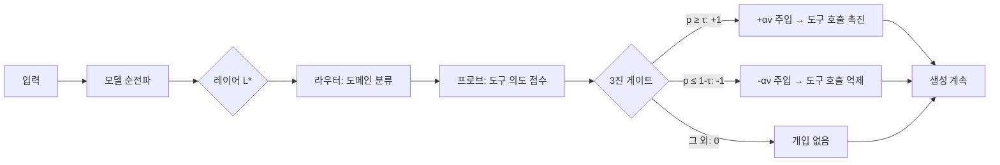

# ASA × LFM2.5-1.2B-Instruct

**학습 없이 도구 호출 능력을 향상시키는 활성화 스티어링**

[🇺🇸 English Version](README.md)

---

## 개요

이 프로젝트는 **ASA (Activation Steering Adapter)** 기법을 [LiquidAI/LFM2.5-1.2B-Instruct](https://huggingface.co/LiquidAI/LFM2.5-1.2B-Instruct) 모델에 적용합니다.

LFM2.5는 10개 LIV 컨볼루션 블록 + 6개 GQA 어텐션 블록으로 구성된 **1.17B 파라미터 하이브리드 모델**입니다.

ASA는 **모델 재학습 없이** 추론 시점에서 도구 호출 능력을 향상시키며, 추가 에셋 크기는 단 ~20KB입니다.

> 📄 논문: [ASA: Training-Free Representation Engineering for Tool-Calling Agents](https://arxiv.org/abs/2602.04935)

## ASA 작동 원리



**핵심 통찰:** LLM은 종종 도구 사용 의도를 내부적으로 표현하지만 실행하지 못하는 "Lazy Agent" 현상이 있습니다. ASA는 숨겨진 상태를 도구 호출 방향으로 살짝 밀어줌으로써 이 표현-행동 간극을 해소합니다.

## 프로젝트 구조

```
Liquid-ASA/
├── data/
│   ├── tools.json           # 4개 도구 정의
│   ├── cal_data.json         # 320개 캘리브레이션 샘플 (벡터 추출)
│   ├── train_data.json       # 320개 학습 샘플 (라우터/프로브)
│   ├── valid_data.json       # 160개 검증 샘플 (하이퍼파라미터 튜닝)
│   └── test_data.json        # 320개 테스트 샘플 (평가)
├── notebooks/
│   └── asa_lfm25_colab.py    # 전체 파이프라인 (Colab T4 호환)
├── outputs/                  # 생성된 에셋, 그래프, 체크포인트
├── ASA_LFM2.5_Implementation_Plan.md
├── README.md                 # English
├── README_KR.md              # 한국어
├── requirements.txt
└── .gitignore
```

## 빠른 시작

### 방법 1: Google Colab (권장) 🚀

1. [Google Colab](https://colab.research.google.com/) 열기
2. 클론 및 실행:

```python
!git clone https://github.com/gyunggyung/Liquid-ASA.git
%cd Liquid-ASA
```

3. **셀 단위 실행**을 위해 노트북으로 변환:

```python
!pip install -q jupytext
!jupytext --to ipynb notebooks/asa_lfm25_colab.py -o notebooks/asa_lfm25_colab.ipynb
```

4. `notebooks/asa_lfm25_colab.ipynb`를 열고 **셀 하나씩 실행** (Shift+Enter)

> 💡 이렇게 하면 각 단계별 출력을 확인하고, 중간에 멈추고, 코드를 수정하고, 다시 실행할 수 있습니다!

### 방법 2: 로컬 실행

```bash
git clone https://github.com/gyunggyung/Liquid-ASA.git
cd Liquid-ASA
pip install -r requirements.txt
python notebooks/asa_lfm25_colab.py
```

### 방법 3: VS Code (Jupyter 확장)

VS Code에서 `notebooks/asa_lfm25_colab.py`를 열면 `# %%` 셀이 자동 인식됩니다. **Shift+Enter**로 셀 단위 실행 가능.

## 파이프라인 단계

| 단계 | 설명 | 출력 |
|------|------|------|
| 1. 환경 설정 | 패키지 설치, GPU 감지 | — |
| 2. 데이터 로딩 | 1,120개 샘플 로드, 분할 검증 | 데이터 통계 |
| 3. 모델 로딩 | LFM2.5를 float16으로 로드 | 모델 정보 |
| 4. 히든 스테이트 추출 | 16개 레이어에 forward hook 설치 | `{layer: (N, D)}` 배열 |
| 5. 프로브 스윕 | 레이어별 로지스틱 회귀 AUC | 최적 레이어 L* + 그래프 |
| 6. 스티어링 벡터 | CAL 데이터로 평균 차이 벡터 생성 | 도메인별 + 글로벌 벡터 |
| 7. 라우터 & 프로브 | 다중 클래스 라우터 + 이진 프로브 | 학습된 분류기 |
| 8. ASA 컨트롤러 | `ASAController` (MoV + 게이트) | 컨트롤러 객체 |
| 9. 하이퍼파라미터 튜닝 | VALID에서 α, τ, β 그리드 서치 | 최적 하이퍼파라미터 + 그래프 |
| 10. 평가 | TEST에서 트리거 메트릭 | Precision/Recall/F1/FPR |
| 11. HF 업로드 | ~20KB 에셋을 HuggingFace에 저장 | 모델 카드 + 에셋 |
| 12. 데모 | 기본 vs ASA 비교 | 대화형 비교 |

> 💡 각 단계는 **체크포인트**됩니다 — 어느 시점에서든 재개할 수 있습니다.

## 데이터셋

**1,120개 수동 제작 샘플** — 4개 도메인 × 4개 분할:

| 도메인 | 도구 | Tool 예시 | Non-Tool 예시 |
|--------|------|-----------|---------------|
| 수학 | `calculator` | "85달러의 15% 팁 계산" | "오일러에 대해 알려줘" |
| 코드 | `python_interpreter` | "리스트 [5,2,8,1] 정렬" | "재귀란 무엇인가?" |
| 검색 | `web_search` | "최신 AI 뉴스 검색" | "광합성이란?" |
| 번역 | `translator` | "'hello'를 한국어로 번역" | "영어의 역사" |

| 분할 | 샘플 수 | 용도 |
|------|---------|------|
| CAL | 320 | 스티어링 벡터 추출 (평균 차이) |
| TRAIN | 320 | 라우터/프로브 학습 (로지스틱 회귀) |
| VALID | 160 | 하이퍼파라미터 튜닝 (α, τ, β) |
| TEST | 320 | 최종 평가 |

## LFM2.5 적응 사항

| 항목 | ASA 논문 (Qwen/LLaMA) | 이 프로젝트 (LFM2.5) |
|------|------------------------|----------------------|
| 아키텍처 | Transformer 전용 | 하이브리드 LIV conv + GQA |
| 파라미터 | 1.5B / 8B | 1.17B |
| 레이어 | 28–32 | 16 (10 LIV + 6 GQA) |
| 도구 토큰 | `<functioncall>` | `<\|tool_call_start\|>` / `<\|tool_call_end\|>` |
| 도구 형식 | JSON | Pythonic (Python 리스트 구문) |
| 개입 전략 | 단일 최적 레이어 | 16개 레이어 전체 프로브 스윕 |

## 예상 결과

ASA 논문의 유사 크기 모델(Qwen2.5-1.5B) 결과 기반:

| 메트릭 | 베이스라인 | ASA (예상) |
|--------|----------|-----------|
| F1 Score | ~0.65 | ~0.80+ |
| FPR (오탐률) | ~0.15 | ~0.05 |
| 에셋 크기 | — | ~20KB |
| 레이턴시 오버헤드 | — | <1ms |

## 인용

```bibtex
@article{asa2025,
  title={ASA: Training-Free Representation Engineering for Tool-Calling Agents},
  author={...},
  journal={arXiv preprint arXiv:2602.04935},
  year={2025}
}
```

## 라이선스

이 프로젝트는 [Apache License 2.0](LICENSE)에 따라 라이선스가 부여됩니다.
