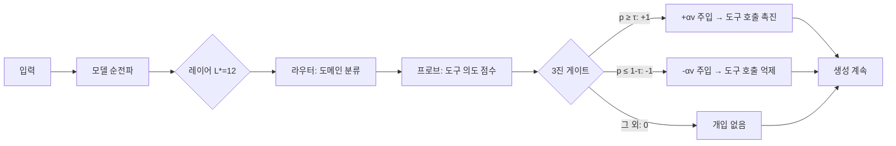

# ASA × LFM2.5-1.2B-Instruct

**학습 없이 도구 호출 능력을 향상시키는 활성화 스티어링**

[🇺🇸 English Version](README.md)

---

## 개요

이 프로젝트는 **ASA (Activation Steering Adapter)** 기법을 [LiquidAI/LFM2.5-1.2B-Instruct](https://huggingface.co/LiquidAI/LFM2.5-1.2B-Instruct) 모델에 적용합니다.

LFM2.5는 10개 LIV 컨볼루션 블록 + 6개 GQA 어텐션 블록으로 구성된 **1.17B 파라미터 하이브리드 모델**입니다.

ASA는 **모델 재학습 없이** 추론 시점에서 도구 호출 능력을 향상시키며, 추가 에셋 크기는 단 ~221KB입니다.

> 📄 논문: [ASA: Training-Free Representation Engineering for Tool-Calling Agents](https://arxiv.org/abs/2602.04935)

## 실험 결과

[Alpaca](https://huggingface.co/datasets/tatsu-lab/alpaca) 공개 데이터셋에서 도메인별 필터링으로 구축한 **1,600 샘플 벤치마크**에서 평가. 논문 프로토콜 준수 (greedy 디코딩, strict `<|tool_call_start|>` 트리거 감지, 분리된 데이터 분할).

### Baseline vs ASA (TEST, 640 샘플)

| 메트릭 | Baseline | ASA | 변화 |
|--------|----------|-----|------|
| **Trigger Precision** | 0.4959 | **0.7591** | +53% ↑ |
| **Trigger Recall** | 0.5656 | 0.5219 | -8% ↓ |
| **Trigger F1** | 0.5285 | **0.6185** | +17% ↑ |
| **FPR (오탐률)** | 0.5750 | **0.1656** | **-71%** ↓↓ |
| **Accuracy** | 0.4953 | **0.6781** | +37% ↑ |

**핵심 발견:** 베이스라인은 non-tool 질문의 57.5%에서 잘못 tool을 트리거합니다. ASA 적용 후 16.6%로 71% 감소.

### 도메인별 (ASA)

| 도메인 | F1 | Precision | Recall | FPR |
|--------|----|-----------|--------|-----|
| 번역 | **0.9262** | 1.0000 | 0.8625 | 0.0000 |
| 수학 | 0.7273 | 0.7568 | 0.7000 | 0.2250 |
| 검색 | 0.5410 | 0.7857 | 0.4125 | 0.1125 |
| 코드 | 0.1565 | 0.2571 | 0.1125 | 0.3250 |

### Ablation 연구 (논문 §4.3)

| 변형 | F1 | FPR | 의미 |
|------|-----|-----|------|
| **Full ASA** | **0.8054** | 0.2375 | 최적 균형 |
| No Gate | 0.6667 | **1.0000** | 게이트가 핵심 안전장치 |
| Global Only | 0.8054 | 0.2375 | 강력한 기본 방향 |
| Domain Only | 0.8054 | 0.2375 | 도메인별 라우팅 |

### 파이프라인 설정

| 파라미터 | 값 |
|----------|-----|
| 최적 레이어 L* | **12** (GQA 블록) |
| Probe AUC at L* | 0.8810 |
| α (스티어링 강도) | 1.0 |
| τ (신뢰 임계값) | 0.50 |
| β (MoV 글로벌 가중치) | 0.0 |
| 에셋 크기 | 221 KB |

### 한계

- **Success Precision = 0**: LFM2.5는 tool call을 bracket 형식(`[func(args)]`)으로 출력하는데, JSON 파서로 검증하므로 0이 됨. 트리거 메트릭에는 영향 없음.
- **Code 도메인 약점** (F1=0.16): Alpaca 키워드 기반 라벨링이 코드 관련 쿼리에서 노이즈가 많음.
- **Edge case 존재**: 유효한 검색 쿼리를 억제하거나 철학적 질문에 tool을 trigger하는 경우 발생 가능. 데이터 라벨링 품질 문제이며, ASA 자체의 한계가 아님.
- **개선 폭**: F1 0.53→0.62로 통계적으로 유의미하나, 개별 case에서는 오류 가능. 더 정밀한 라벨링 데이터로 개선 여지 있음.

### 데모: Baseline vs ASA

```
[TOOL] "Calculate the average rating for this product"
  Baseline: 트리거 안 됨 ❌  →  ASA: TRIGGERED ✅ (p=0.999, gate=+1)

[NO-TOOL] "Construct an analogy to explain a capacitor"
  Baseline: TRIGGERED ❌     →  ASA: 트리거 안 됨 ✅ (p=0.000, gate=-1)

[TOOL] "Calculate the month number for August 24"
  Baseline: 트리거 안 됨 ❌  →  ASA: TRIGGERED ✅ (p=0.998, gate=+1)

[NO-TOOL] "Provide an analogy to compare a computer to"
  Baseline: TRIGGERED ❌     →  ASA: 트리거 안 됨 ✅ (p=0.021, gate=-1)
```

## ASA 작동 원리



**핵심 통찰:** LLM은 종종 도구 사용 의도를 내부적으로 표현하지만 실행하지 못하는 "Lazy Agent" 현상이 있습니다. ASA는 숨겨진 상태를 도구 호출 방향으로 살짝 밀어줌으로써 이 표현-행동 간극을 해소합니다.

## 프로젝트 구조

```
Liquid-ASA/
├── ASA_LFM25_Pipeline.ipynb    # 📓 메인 노트북 (Colab T4)
├── create_notebook.py           # .ipynb 생성 스크립트
├── data/
│   └── tools.json               # 4개 도구 정의 (스키마 화이트리스트)
├── outputs/
│   ├── asa_assets/              # 🚀 배포 가능 에셋 (221KB)
│   │   ├── config.json          #    L*=12, α=1, τ=0.5, β=0.0
│   │   ├── steering_vectors.npz #    도메인+글로벌 벡터
│   │   ├── router.pkl           #    도메인 분류기
│   │   ├── probes.pkl           #    도메인별 intent 프로브
│   │   └── scaler.pkl           #    히든 스테이트 정규화기
│   ├── probe_sweep.png          # 레이어 AUC 시각화
│   ├── hp_sweep.png             # α/τ/β 튜닝 그래프
│   └── baseline_vs_asa.png      # 비교 차트
├── README.md
├── README_KR.md
├── requirements.txt
└── LICENSE
```

## 빠른 시작

### 파이프라인 실행 (Google Colab)

1. `ASA_LFM25_Pipeline.ipynb`를 [Google Colab](https://colab.research.google.com/)에 업로드
2. **T4 GPU** 런타임 선택
3. **모두 실행** — 총 ~30분

노트북이 자동으로 Alpaca 데이터를 다운로드하고, 전체 파이프라인을 실행하고, 에셋을 `outputs/`에 저장합니다.

### 에셋 사용 (로컬)

파이프라인을 다시 실행할 필요 없이, 저장된 에셋만으로 ASA를 사용할 수 있습니다:

```python
import pickle, json, numpy as np, torch
from transformers import AutoTokenizer, AutoModelForCausalLM

# 모델 로드
model = AutoModelForCausalLM.from_pretrained(
    "LiquidAI/LFM2.5-1.2B-Instruct",
    dtype=torch.float16, device_map="auto", trust_remote_code=True)
tokenizer = AutoTokenizer.from_pretrained(
    "LiquidAI/LFM2.5-1.2B-Instruct", trust_remote_code=True)

# ASA 에셋 로드 (총 221KB)
vecs   = np.load("outputs/asa_assets/steering_vectors.npz")
router = pickle.load(open("outputs/asa_assets/router.pkl", "rb"))
probes = pickle.load(open("outputs/asa_assets/probes.pkl", "rb"))
scaler = pickle.load(open("outputs/asa_assets/scaler.pkl", "rb"))
config = json.load(open("outputs/asa_assets/config.json"))

# ASA hook 정의
_injected = False
def asa_hook(module, inp, out):
    global _injected
    if _injected: return out
    _injected = True
    h = out[0] if isinstance(out, tuple) else out
    hl = h[:, -1, :].detach().cpu().float().numpy()
    hs = scaler.transform(hl)
    dom = config["domains"][router.predict(hs)[0]]
    pt = probes[dom].predict_proba(hs)[0, 1] if dom in probes else 0.5
    gate = 1 if pt >= config["tau"] else (-1 if pt <= 1-config["tau"] else 0)
    if gate == 0: return out
    v = vecs[dom]; v = v / (np.linalg.norm(v) + 1e-8)
    vt = torch.tensor(v, dtype=torch.float16).to(h.device)
    hn = h.clone(); hn[:, -1, :] += gate * config["alpha"] * vt
    rest = out[1:] if isinstance(out, tuple) else None
    return (hn,) + rest if rest else hn

# 사용법
_injected = False
hook = model.model.layers[config["L_star"]].register_forward_hook(asa_hook)
# ... model.generate() 평소처럼 사용 ...
hook.remove()
```

### 대화형 채팅 (Colab)

노트북 마지막에 새 셀 추가:

```python
while True:
    q = input("\n질문: ")
    if q.lower() in ("quit", "exit"): break
    msgs = [{"role": "system", "content": SYS_PROMPT},
            {"role": "user", "content": q}]
    bl = generate(msgs)
    _injected = False
    asa_out = generate(msgs, hook_fn=asa_hook, layer=L_STAR)
    print(f"[Baseline] {'🔧 TOOL' if TOOL_S in bl else '💬 TEXT'}")
    print(bl[:300])
    print(f"[ASA]      {'🔧 TOOL' if TOOL_S in asa_out else '💬 TEXT'}")
    print(asa_out[:300])
```

## LFM2.5 적응 사항

| 항목 | ASA 논문 (Qwen/LLaMA) | 이 프로젝트 (LFM2.5) |
|------|------------------------|----------------------|
| 아키텍처 | Transformer 전용 | 하이브리드 LIV conv + GQA |
| 파라미터 | 1.5B / 8B | 1.17B |
| 레이어 | 28–32 | 16 (10 LIV + 6 GQA) |
| 도구 토큰 | `<functioncall>` | `<\|tool_call_start\|>` / `<\|tool_call_end\|>` |
| 도구 형식 | JSON | Bracket 표기법 `[func(args)]` |
| 최적 레이어 | L18–L21 | **L12** (GQA 블록) |
| 데이터 소스 | Alpaca + NQ | Alpaca (자동 다운로드) |

## 인용

```bibtex
@article{asa2025,
  title={ASA: Training-Free Representation Engineering for Tool-Calling Agents},
  author={...},
  journal={arXiv preprint arXiv:2602.04935},
  year={2025}
}
```

## 라이선스

이 프로젝트는 [Apache License 2.0](LICENSE)에 따라 라이선스가 부여됩니다.
